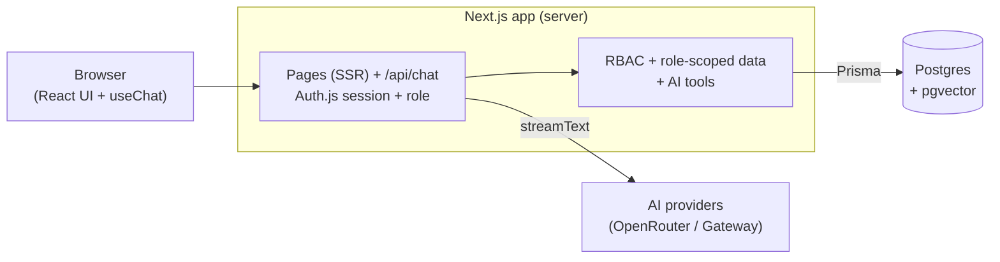
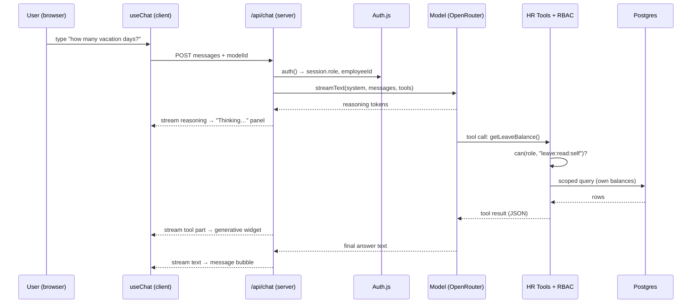
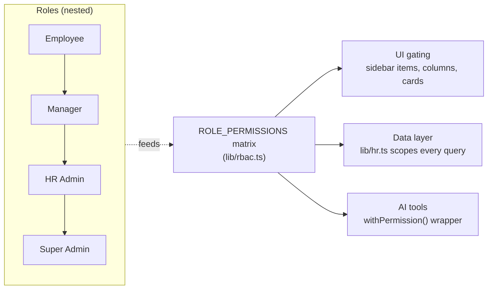
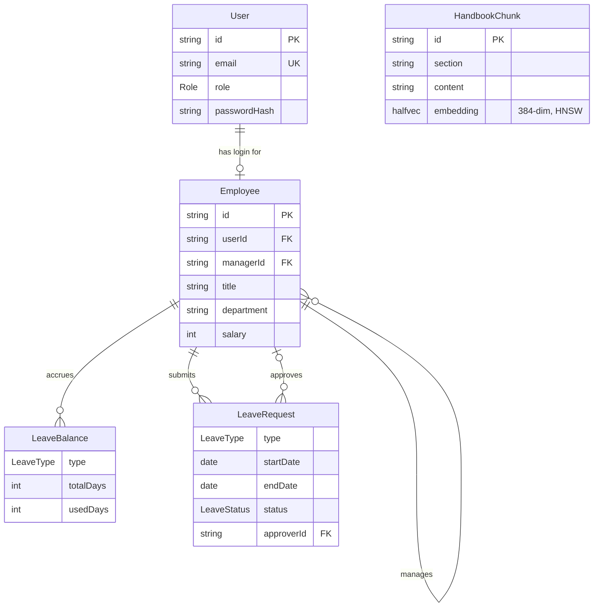
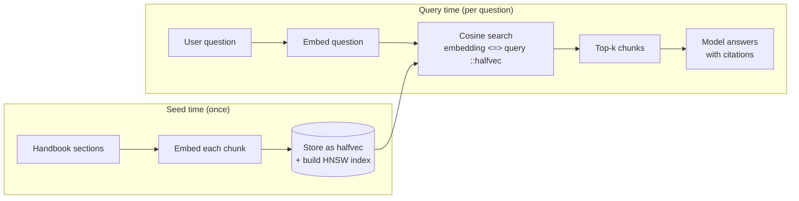

# HARI — AI-Powered HR Platform Starter

A reference implementation of an **AI-powered HR platform** (think BambooHR + a built-in
assistant). It is intentionally a *starter*: it doesn't try to be a complete HR product, it
shows — with as little code as possible — how to build a **production-shaped AI feature** that is
safe, observable, and pleasant to use.

> One page is the star of the show: a chat assistant that **streams its reasoning**, **calls
> permission-checked tools**, **answers from your handbook with citations (RAG)**, and **renders
> rich UI inline** — all gated by real role-based access control.

---

## Why this stack (the pitch)

| Concern | Choice | Why it's the right call |
|---|---|---|
| Framework | **Next.js (App Router)** | One codebase for UI *and* API. Server Components keep data on the server; Route Handlers stream AI responses. No separate backend to deploy. |
| Language | **TypeScript** (strict) | Types flow from the DB (Prisma) → tools → UI. Refactors are safe. |
| Styling | **Tailwind v4 + shadcn/ui** | Accessible components you *own* (copied into `components/ui`), themed with utility classes. No design debt. |
| AI | **Vercel AI SDK** | Provider-agnostic. `streamText` + `useChat` give streaming, tool-calling, reasoning, and multi-step loops for free. |
| Providers | **OpenRouter** (default, free models) + **Vercel AI Gateway** | Swap models with one string. Demo runs at $0 on OpenRouter; Gateway adds OpenAI/Google when you want them. |
| Database | **Postgres + pgvector (`halfvec`)** | One database for relational data *and* vector search. `halfvec` halves embedding storage; HNSW index makes search fast. |
| ORM | **Prisma** | Typed queries + migrations. Raw SQL only where vectors need it. |
| Auth | **Auth.js (NextAuth v5)** | Battle-tested sessions; we add a tiny role claim and a permission matrix. |
| Infra | **Docker Compose** | `docker compose up` → database, admin UI, and app. Reproducible on any machine. |

**The thesis:** these pieces compose into a full-stack AI app that one developer can understand
end-to-end, yet every piece is independently swappable and production-grade.

---

## What it demonstrates

- **RBAC everywhere** — one permission matrix gates the **UI**, **server data access**, and **AI tools**.
- **Thinking UI** — the model's reasoning streams into a collapsible panel.
- **Tool-call UI** — every tool call is shown live (running → result), including **permission denials**.
- **Generative UI** — tool results render as React components (employee cards, leave widgets, payslips), not walls of text.
- **RAG with citations** — vector search over an employee handbook; answers cite their sources.
- **Multi-step** — the assistant chains tools (e.g. *check balance → submit request*).
- **Four demo roles** — one click to sign in and watch the whole experience change.

---

## Quick start

```bash
cp .env.example .env          # then fill in keys (see below)
docker compose up --build     # db + adminer + app
# open http://localhost:3000  → pick a demo role
```

That single command starts **Postgres (pgvector)**, **Adminer** (DB UI on `:8080`), and the **app**.
On first boot the app pushes the Prisma schema and seeds demo data automatically.

### Keys (`.env`)

| Variable | Needed for | Notes |
|---|---|---|
| `OPENROUTER_API_KEY` | Chat **and** RAG embeddings | Free at [openrouter.ai/keys](https://openrouter.ai/keys). Chat uses `:free` models; embeddings use a free lightweight model (`all-MiniLM-L6-v2`, 384d). **This one key powers the whole demo.** |
| `AUTH_SECRET` | Sessions | `npx auth secret` to generate. |
| `AI_GATEWAY_API_KEY` | Optional | Enables the Vercel AI Gateway models in the chat picker. |

### Run locally without Docker

```bash
npm install
docker compose up -d db        # just Postgres
npm run db:push && npm run db:seed
npm run dev
```

### Demo logins (password `password123`)

| Role | Email | Can do |
|---|---|---|
| Employee | `employee@acme.test` | Own profile, own leave/payslip, ask the handbook |
| Manager | `manager@acme.test` | + see direct reports, approve their leave |
| HR Admin | `hr@acme.test` | + whole company, salaries, any payslip |
| Super Admin | `admin@acme.test` | + platform settings |

---

## Architecture

### The big picture

Everything is one Next.js app. The browser talks only to Next.js; Next.js talks to Postgres and
to the AI providers. There is no separate backend service.



### Frontend vs. backend vs. SSR — who does what

This is the part most worth understanding. Next.js blurs the front/back line, so here's the map:

| Layer | Runs where | In this repo | Responsibility |
|---|---|---|---|
| **Server Components (SSR)** | Server, per request | `app/(dashboard)/**/page.tsx`, `layout.tsx` | Fetch data with Prisma, enforce RBAC, render HTML. **No data leaves the server unless the role allows it.** |
| **Client Components** | Browser | `components/chat/**`, `sidebar.tsx` | Interactivity: the chat stream, model picker, collapsible reasoning. Marked `"use client"`. |
| **Route Handlers (API)** | Server | `app/api/chat/route.ts`, `app/api/auth/[...]` | The AI backend: authenticate, build tools, stream the model response. |
| **Server Actions** | Server | `app/login/actions.ts`, `lib/auth-actions.ts` | Form submissions (login/logout) without a REST endpoint. |
| **Shared domain logic** | Server | `lib/rbac.ts`, `lib/hr.ts`, `lib/ai/**`, `lib/rag.ts` | The “real” backend: permissions, data access, tools, retrieval — reused by both pages and the AI. |

Key idea: **`lib/hr.ts` is the single, role-scoped data layer.** Both the dashboard pages *and*
the AI tools call it, so **the chatbot can never read more than the UI would show** for that role.

### What happens when you send a chat message



If a tool the role isn't allowed to use is invoked, `withPermission` returns
`{ denied: true }` instead of touching the database — the UI renders a **“permission denied”**
card and the model explains it. Defense in depth: the model is *told* the role's permissions in
the system prompt, **and** the server enforces them regardless.

### Role-based access control

One matrix, three enforcement points. Defined once in `lib/rbac.ts`:



Permissions are **strictly nested** (Employee ⊂ Manager ⊂ HR Admin ⊂ Super Admin) — verified by a
unit test. The Settings page renders the full matrix live.

### Data model



`HandbookChunk` is intentionally standalone — it's the RAG corpus, with no foreign keys
into the HR tables. Every `Employee` links to exactly one `User`; an `Employee` both
**submits** their own leave requests and (as a manager) **approves** others'.

### RAG pipeline (handbook search)



Vectors are stored as pgvector **`halfvec(384)`** (16-bit floats — half the size of `vector`) and
queried with the cosine operator `<=>`, accelerated by an **HNSW** index. The embedding model
(default `all-MiniLM-L6-v2`) is swappable in `lib/ai/embeddings.ts` — just keep the `halfvec(N)`
size in `schema.prisma` in sync. See `lib/rag.ts` and the index created in `prisma/seed.ts`.

---

## Project structure

```
hr-boilerplate/
├─ docker-compose.yml          # db (pgvector) + adminer + app
├─ Dockerfile                  # dev image for the Next.js app
├─ docker/db-init/             # CREATE EXTENSION vector on first boot
├─ prisma/
│  ├─ schema.prisma            # User, Employee, Leave*, HandbookChunk(halfvec)
│  ├─ seed.ts                  # demo people + embedded handbook + HNSW index
│  └─ handbook.ts              # the RAG corpus (plain text)
├─ src/
│  ├─ app/
│  │  ├─ login/                # role picker + manual sign-in (Server Actions)
│  │  ├─ (dashboard)/          # SSR pages, guarded by the layout
│  │  │  ├─ page.tsx           # overview (role-aware stats)
│  │  │  ├─ chat/              # the AI assistant page (the showcase)
│  │  │  ├─ directory/         # role-scoped people table
│  │  │  ├─ time-off/          # balances, requests, approvals
│  │  │  └─ settings/          # live permission matrix (admin only)
│  │  └─ api/
│  │     ├─ chat/route.ts      # streamText + tools + reasoning + multi-step
│  │     └─ auth/[...nextauth] # Auth.js handlers
│  ├─ components/
│  │  ├─ ui/                   # shadcn primitives (owned by us)
│  │  ├─ layout/               # sidebar, page header
│  │  └─ chat/                 # message, reasoning, tool-call, generative/*
│  └─ lib/
│     ├─ rbac.ts               # permission matrix + can()  [core]
│     ├─ auth.ts / session.ts  # Auth.js config + server-side session helpers
│     ├─ hr.ts                 # role-scoped data access, shared by UI + AI  [core]
│     ├─ rag.ts                # vector search
│     └─ ai/
│        ├─ providers.ts       # model registry (OpenRouter default + Gateway)
│        ├─ tools.ts           # RBAC-gated HR tools  [core]
│        └─ embeddings.ts      # embeddings via OpenRouter (all-MiniLM-L6-v2, swappable)
└─ tests/                      # vitest: RBAC + tool integration + live LLM
```

---

## Security measures

This starter models the patterns a real HR app needs:

1. **Server-side authorization, always.** Every page and every tool re-checks the session on the
   server (`auth()` via `lib/session.ts`). The client-supplied role is never trusted for access decisions.
2. **One permission source of truth.** `lib/rbac.ts` defines the matrix; UI, data layer, and AI
   tools all consult it. There is no second place where rules can drift.
3. **Role-scoped data access.** `lib/hr.ts` adds `WHERE` clauses based on role, so an employee's
   directory query returns only themselves — the filter is in the query, not in the UI.
4. **Field-level redaction.** Sensitive fields (salary) are stripped server-side unless the role
   holds `salary:read:all`; they never reach the browser.
5. **Tools fail closed.** `withPermission()` returns a structured denial *before* any DB call; a
   missing permission can't accidentally execute.
6. **Defense in depth for the model.** The system prompt lists the user's permissions, *and* the
   server enforces them anyway — a jailbroken prompt still can't exceed the role.
7. **Password hashing.** Credentials are verified with `bcrypt`; only hashes are stored.
8. **Secrets stay server-side.** API keys live in `.env` (git-ignored) and are read only in
   server code / Route Handlers — never shipped to the client.
9. **SQL safety.** Prisma parameterizes all queries; the one raw vector query binds the embedding
   as a parameter and casts it (`$1::halfvec`).

> Demo caveats (called out so they aren't mistaken for production): demo accounts share a password,
> `AUTH_SECRET` ships with a placeholder, and the Dockerfile is dev-oriented. Rotate secrets and add
> a multi-stage production build before deploying.

---

## Testing

```bash
npm test          # vitest run (17 tests)
```

- **`tests/rbac.test.ts`** — the permission matrix (nesting, role capabilities). Pure, no DB.
- **`tests/tools.integration.test.ts`** — runs the real AI tools against a seeded Postgres and
  asserts role scoping (employee sees 1 person, manager 4, HR 6), salary redaction, and **denials**
  (employee blocked from others' payslips / approvals).
- **`tests/openrouter.live.test.ts`** — a live OpenRouter call proving generation **and**
  tool-calling work. Auto-skips when `OPENROUTER_API_KEY` is unset.

The build (`npm run build`) typechecks the whole project.

---

## Customizing

- **Add a model:** append to `CHAT_MODELS` in `lib/ai/providers.ts`. Free OpenRouter ids end in `:free`.
- **Add a permission:** add to `PERMISSIONS` in `lib/rbac.ts`, assign it to roles, use it via
  `can()` / `withPermission()`.
- **Add a tool:** add a `tool({...})` in `lib/ai/tools.ts` (wrap `execute` with `gated`), then a
  renderer in `components/chat/tool-call.tsx`.
- **Change the handbook:** edit `prisma/handbook.ts` and re-run `npm run db:seed`.
