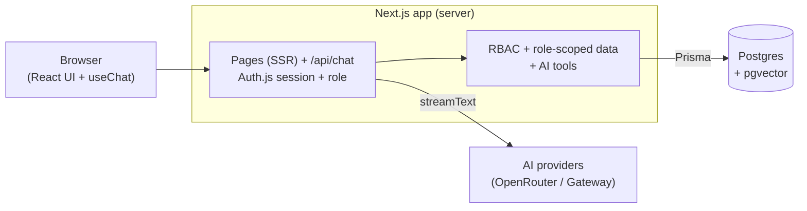
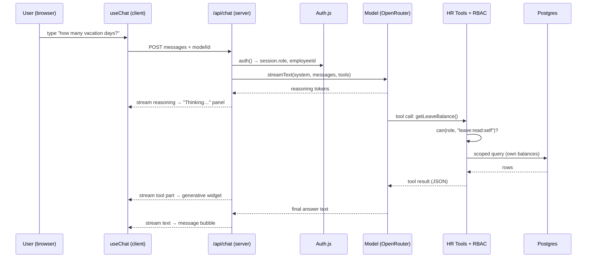
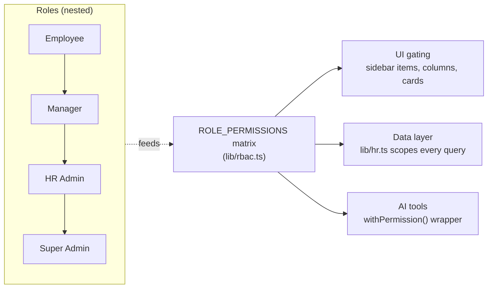
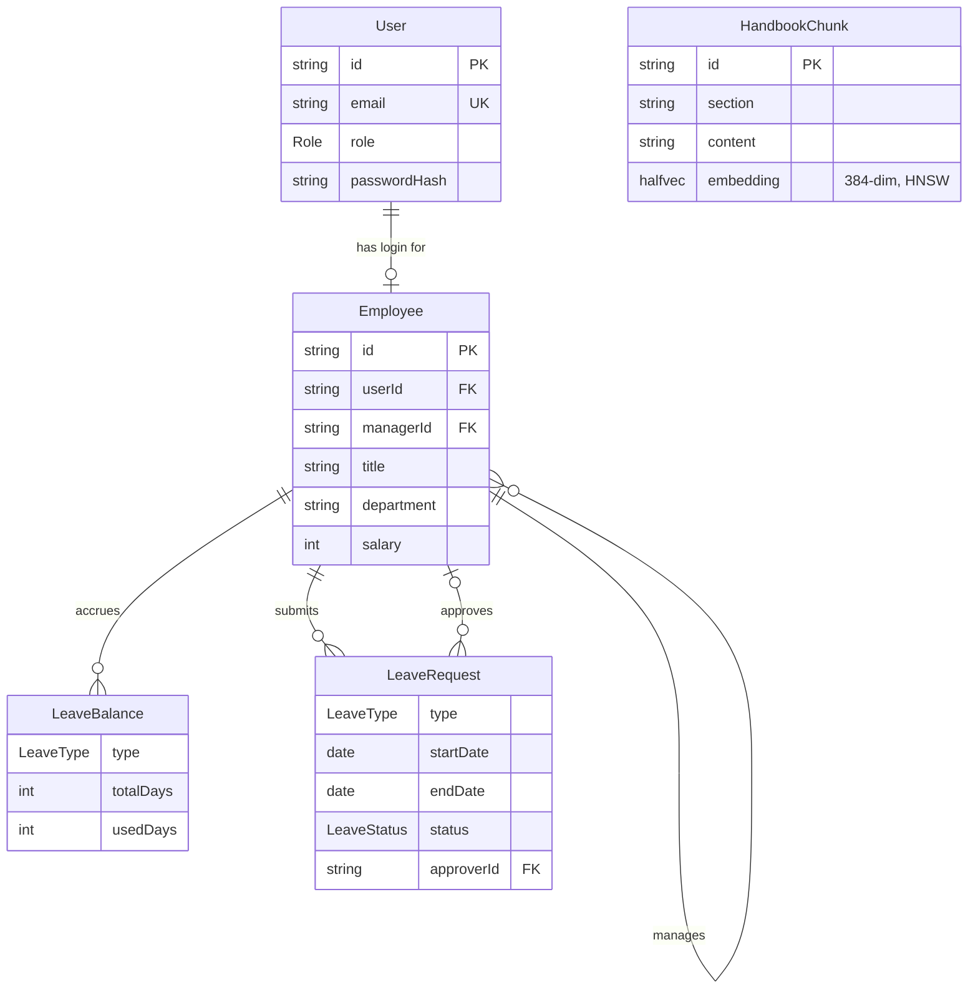
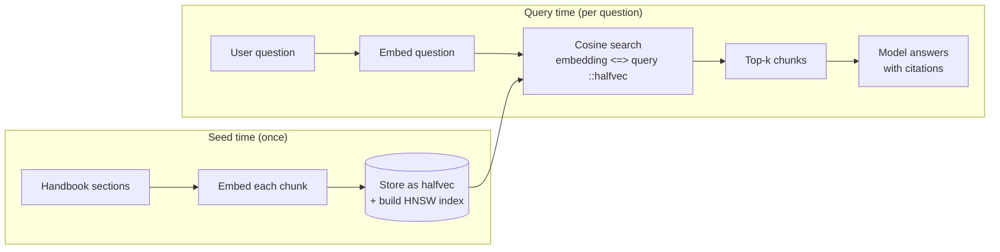

# HARI — AI-Powered HR Platform Starter

A reference implementation of an **AI-powered HR platform** (think BambooHR + a built-in
assistant). It is intentionally a *starter*: it doesn't try to be a complete HR product, it
shows — with as little code as possible — how to build a **production-shaped AI feature** that is
safe, observable, and pleasant to use.

> One page is the star of the show: a chat assistant that **streams its reasoning**, **calls
> permission-checked tools**, **answers from your handbook with citations (RAG)**, and **renders
> rich UI inline** — all gated by real role-based access control.

---

## Why this stack (the pitch)

| Concern | Choice | Why it's the right call |
|---|---|---|
| Framework | **Next.js (App Router)** | One codebase for UI *and* API. Server Components keep data on the server; Route Handlers stream AI responses. No separate backend to deploy. |
| Language | **TypeScript** (strict) | Types flow from the DB (Prisma) → tools → UI. Refactors are safe. |
| Styling | **Tailwind v4 + shadcn/ui** | Accessible components you *own* (copied into `components/ui`), themed with utility classes. No design debt. |
| AI | **Vercel AI SDK** | Provider-agnostic. `streamText` + `useChat` give streaming, tool-calling, reasoning, and multi-step loops for free. |
| Providers | **OpenRouter** (default, free models) + **Vercel AI Gateway** | Swap models with one string. Demo runs at $0 on OpenRouter; Gateway adds OpenAI/Google when you want them. |
| Database | **Postgres + pgvector (`halfvec`)** | One database for relational data *and* vector search. `halfvec` halves embedding storage; HNSW index makes search fast. |
| ORM | **Prisma** | Typed queries + migrations. Raw SQL only where vectors need it. |
| Auth | **Auth.js (NextAuth v5)** | Battle-tested sessions; we add a tiny role claim and a permission matrix. |
| Infra | **Docker Compose** | `docker compose up` → database, admin UI, and app. Reproducible on any machine. |

**The thesis:** these pieces compose into a full-stack AI app that one developer can understand
end-to-end, yet every piece is independently swappable and production-grade.

---

## What it demonstrates

- **RBAC everywhere** — one permission matrix gates the **UI**, **server data access**, and **AI tools**.
- **Per-role tool catalogue** — the assistant is only given the tools its role can use; out-of-scope tools are never injected, so it knows exactly what it can and can't do.
- **Thinking UI** — the model's reasoning streams into a collapsible panel.
- **Tool-call UI** — every tool call is shown live (running → result), with rich result cards.
- **Generative UI** — tool results render as React components (employee cards, leave widgets, payslips), not walls of text.
- **Knowledge base with anchor-cited RAG** — a governed KB (collections, draft/publish lifecycle, 3-tier access) authored in a Notion-style editor; **hybrid search** (vector + full-text, RRF-fused) and answers that cite the exact article section.
- **Multi-step** — the assistant chains tools (e.g. *check balance → submit request*).
- **Four demo roles** — one click to sign in and watch the whole experience change.

---

## Quick start

**Prerequisites:** Docker + Docker Compose, and a free [OpenRouter API key](https://openrouter.ai/keys).

```bash
cp .env.example .env                       # paste your OPENROUTER_API_KEY into .env
docker compose up --build                  # starts db + adminer + app
# open http://localhost:3000  → pick a demo role (password: password123)
```

That single command starts **Postgres (pgvector)**, **Adminer** (DB UI on `:8080`), and the **app**.
On first boot the app runs the Prisma migrations and seeds demo data automatically
(`prisma migrate deploy && prisma db seed`). The default `.env` already has a working
`AUTH_SECRET`, so the **only** value you must set is `OPENROUTER_API_KEY`.

> Without `OPENROUTER_API_KEY` the app still boots and you can log in and browse — but the
> AI chat and handbook RAG won't work until you add the key and re-run `npm run db:seed`.

### Keys (`.env`)

| Variable | Needed for | Notes |
|---|---|---|
| `OPENROUTER_API_KEY` | Chat **and** RAG embeddings | Free at [openrouter.ai/keys](https://openrouter.ai/keys). Chat uses `:free` models; embeddings use a free lightweight model (`all-MiniLM-L6-v2`, 384d). **This one key powers the whole demo.** |
| `AUTH_SECRET` | Sessions | `npx auth secret` to generate. |
| `AI_GATEWAY_API_KEY` | Optional | Enables the Vercel AI Gateway models in the chat picker. |

### Run locally without Docker

**Node version:** this project is standardized on **Node 22 LTS** (the same major as the
`node:22-alpine` Docker image). The target is pinned in [`.nvmrc`](.nvmrc) and enforced via
`package.json#engines` + [`.npmrc`](.npmrc) (`engine-strict=true`), so `npm install` fails fast
on an unsupported version.

```bash
# 1. Use the project's Node version (with nvm / nvm-windows / fnm)
nvm install        # reads .nvmrc → installs Node 22
nvm use            # switches the current shell to Node 22

# 2. Verify you're on the right version
node --version     # → v22.x.x   (must be 22, not 20/24)
npm --version      # → 10.x or 11.x

# 3. Install & run
npm install
docker compose up -d db        # just Postgres
npm run db:deploy && npm run db:seed   # apply migrations, then seed
npm run dev
```

> Don't have nvm? Install Node 22 LTS directly from [nodejs.org](https://nodejs.org/) (pick the
> "LTS" download). On Windows, [nvm-windows](https://github.com/coreybutler/nvm-windows) or
> [fnm](https://github.com/Schniz/fnm) both read `.nvmrc`.

Schema changes go through Prisma migrations: edit `schema.prisma`, run
`npm run db:migrate` (creates a new migration), commit the generated SQL.
`npm run db:reset` rebuilds the dev DB from scratch (migrations + seed).

### Demo logins (password `password123`)

| Role | Email | Can do |
|---|---|---|
| Employee | `collaborateur@hari.ma` | Own profile, own leave/payslip, ask the handbook |
| Manager | `manager@hari.ma` | + see direct reports, approve their leave |
| HR Admin | `rh@hari.ma` | + whole company, salaries, any payslip |
| Super Admin | `admin@hari.ma` | + platform settings |

---

## Architecture

### The big picture

Everything is one Next.js app. The browser talks only to Next.js; Next.js talks to Postgres and
to the AI providers. There is no separate backend service.



### Frontend vs. backend vs. SSR — who does what

This is the part most worth understanding. Next.js blurs the front/back line, so here's the map:

| Layer | Runs where | In this repo | Responsibility |
|---|---|---|---|
| **Server Components (SSR)** | Server, per request | `app/(dashboard)/**/page.tsx`, `layout.tsx` | Fetch data with Prisma, enforce RBAC, render HTML. **No data leaves the server unless the role allows it.** |
| **Client Components** | Browser | `components/chat/**`, `sidebar.tsx` | Interactivity: the chat stream, model picker, collapsible reasoning. Marked `"use client"`. |
| **Route Handlers (API)** | Server | `app/api/chat/route.ts`, `app/api/auth/[...]` | The AI backend: authenticate, build tools, stream the model response. |
| **Server Actions** | Server | `app/login/actions.ts`, `lib/auth-actions.ts` | Form submissions (login/logout) without a REST endpoint. |
| **Shared domain logic** | Server | `lib/rbac.ts`, `lib/hr.ts`, `lib/ai/**`, `lib/rag.ts` | The “real” backend: permissions, data access, tools, retrieval — reused by both pages and the AI. |

Key idea: **`lib/hr.ts` is the single, role-scoped data layer.** Both the dashboard pages *and*
the AI tools call it, so **the chatbot can never read more than the UI would show** for that role.

### What happens when you send a chat message



The assistant is only given the tools its role can use. `buildHrTools` advertises
the subset of the catalogue the role is permitted, so an out-of-scope tool is never even injected and
the model can't attempt it. Defense in depth: the model is *told* its exact capabilities in the system
prompt, **and** the server still re-checks every call and scopes every read regardless. Where a
parameter would only ever be out of scope for a role, it's dropped from that role's tool schema, so a
non-elevated user can't even ask for another's payslip. Any refusal that remains returns `{ refused }`,
which the assistant works around silently: the UI shows nothing, and there's no "permission denied" card.

> **Deep dive:** [Authorized AI chat — full sequence diagram](docs/architecture/authorized-ai-chat-sequence.md)
> (auth gate, permission branches, RAG sub-flow, multi-step loop) ·
> [Authorization invariants](docs/architecture/authorization-invariants.md) (the contributor contract) ·
> [Authorized chat scenario](docs/architecture/chat-authorization-scenario.md) (the authorized / refusal / alert demo script).

### Role-based access control

One matrix, three enforcement points. Defined once in `lib/rbac.ts`:



Permissions are **strictly nested** (Employee ⊂ Manager ⊂ HR Admin ⊂ Super Admin) — verified by a
unit test. The Settings page renders the full matrix live.

### Data model



`HandbookChunk` is intentionally standalone — it's the RAG corpus, with no foreign keys
into the HR tables. Every `Employee` links to exactly one `User`; an `Employee` both
**submits** their own leave requests and (as a manager) **approves** others'.

### RAG pipeline (handbook search)



Vectors are stored as pgvector **`halfvec(384)`** (16-bit floats — half the size of `vector`) and
queried with the cosine operator `<=>`, accelerated by an **HNSW** index. The extension, column,
and index are all created in the Prisma migration (`prisma/migrations/0_init`). The embedding model
is env-selectable (`EMBEDDING_MODEL`); any other 384-dim model is a drop-in, while a different
dimension needs a migration to ALTER the column. See `lib/rag.ts` and `lib/ai/embeddings.ts`.

> **Deep dives:** [Knowledge Base — architecture](docs/architecture/knowledge-base.md)
> (collections/documents/lifecycle, 3-tier access, hybrid vector+FTS retrieval, anchor
> citations, authoring) · [HR handbook RAG — architecture](docs/architecture/hr-rag-architecture.md)
> (indexing/retrieval pipelines, `halfvec`/HNSW choices, changing the embedding model).

---

## Project structure

```
hr-boilerplate/
├─ docker-compose.yml          # db (pgvector) + adminer + app
├─ Dockerfile                  # dev image for the Next.js app
├─ docker/db-init/             # CREATE EXTENSION vector on first boot
├─ prisma/
│  ├─ schema.prisma            # User, Employee, Leave*, HandbookChunk(halfvec)
│  ├─ migrations/0_init/       # extension + tables + halfvec column + HNSW index
│  ├─ seed.ts                  # data only: demo people + embedded handbook
│  └─ handbook.ts              # the RAG corpus (plain text)
├─ src/
│  ├─ app/
│  │  ├─ login/                # role picker + manual sign-in (Server Actions)
│  │  ├─ (dashboard)/          # SSR pages, guarded by the layout
│  │  │  ├─ page.tsx           # overview (role-aware stats)
│  │  │  ├─ chat/              # the AI assistant page (the showcase)
│  │  │  ├─ directory/         # role-scoped people table
│  │  │  ├─ time-off/          # balances, requests, approvals
│  │  │  └─ settings/          # live permission matrix (admin only)
│  │  └─ api/
│  │     ├─ chat/route.ts      # streamText + tools + reasoning + multi-step
│  │     └─ auth/[...nextauth] # Auth.js handlers
│  ├─ components/
│  │  ├─ ui/                   # shadcn primitives (owned by us)
│  │  ├─ layout/               # sidebar, page header
│  │  └─ chat/                 # message, reasoning, tool-call, generative/*
│  └─ lib/
│     ├─ rbac.ts               # permission matrix + can()  [core]
│     ├─ auth.ts / session.ts  # Auth.js config + server-side session helpers
│     ├─ hr.ts                 # role-scoped data access, shared by UI + AI  [core]
│     ├─ rag.ts                # vector search
│     └─ ai/
│        ├─ providers.ts       # model registry (OpenRouter default + Gateway)
│        ├─ tools.ts           # RBAC-gated HR tools  [core]
│        └─ embeddings.ts      # embeddings via OpenRouter (all-MiniLM-L6-v2, swappable)
└─ tests/                      # vitest: RBAC + tool integration + live LLM
```

---

## Security measures

This starter models the patterns a real HR app needs:

1. **Server-side authorization, always.** Every page and every tool re-checks the session on the
   server (`auth()` via `lib/session.ts`). The client-supplied role is never trusted for access decisions.
2. **One permission source of truth.** `lib/rbac.ts` defines the matrix; UI, data layer, and AI
   tools all consult it. There is no second place where rules can drift.
3. **Role-scoped data access.** `lib/hr.ts` adds `WHERE` clauses based on role, so an employee's
   directory query returns only themselves — the filter is in the query, not in the UI.
4. **Field-level redaction.** Sensitive fields (salary) are stripped server-side unless the role
   holds `salary:read:all`; they never reach the browser.
5. **Tools advertised per role, fail closed.** `buildHrTools` only injects the tools a role may
   use, so an out-of-scope tool is never offered. Per-tool `withPermission()` still re-checks *before*
   any DB call (defense in depth) and returns a silent `{ refused }`, so a missing permission can't execute.
6. **Defense in depth for the model.** The system prompt lists the user's permissions, *and* the
   server enforces them anyway — a jailbroken prompt still can't exceed the role.
7. **Password hashing.** Credentials are verified with `bcrypt`; only hashes are stored.
8. **Secrets stay server-side.** API keys live in `.env` (git-ignored) and are read only in
   server code / Route Handlers — never shipped to the client.
9. **SQL safety.** Prisma parameterizes all queries; the one raw vector query binds the embedding
   as a parameter and casts it (`$1::halfvec`).

> Demo caveats (called out so they aren't mistaken for production): demo accounts share a password,
> `AUTH_SECRET` ships with a placeholder, and the Dockerfile is dev-oriented. Rotate secrets and add
> a multi-stage production build before deploying.

---

## Testing

Tests are split in two so `npm test` is **deterministic** — it never touches the network, so it
can't flake on model output or rate limits. The live OpenRouter suites are opt-in.

```bash
npm test          # deterministic suite — no network / no API key (the CI default)
npm run test:live # live suite — real OpenRouter calls (needs OPENROUTER_API_KEY)
npm run test:all  # both
```

**Deterministic suite (`npm test`)**

- **`tests/rbac.test.ts`** — the permission matrix (nesting, role capabilities). Pure, no DB.
- **`tests/tools.integration.test.ts`** — runs the real AI tools against a seeded Postgres and
  asserts role scoping (employee sees 1 person, manager 4, HR 6), salary redaction, **per-role tool
  exposure** (an employee isn't even offered the approval tools), and clean refusals (a request for
  another's payslip or another team's leave returns a silent `{ refused }` instead of data).

**Live suite (`npm run test:live` — files end in `*.live.test.ts`)**

- **`tests/openrouter.live.test.ts`** — a live OpenRouter call proving generation **and**
  tool-calling work.
- **`tests/rag.live.test.ts`** — embeds a query via OpenRouter and runs the pgvector cosine
  search over the seeded handbook.

Each live suite self-skips when `OPENROUTER_API_KEY` is unset, so `npm run test:all` stays green
in a keyless CI. The deterministic suite still needs a running Postgres (`DATABASE_URL`) for the
integration tests. The build (`npm run build`) typechecks the whole project.

CI (`.github/workflows/test.yml`) runs the deterministic suite on every push/PR against a
`pgvector` service container — no secrets, no network calls, so it can't flake.

---

## Customizing

- **Add a model:** append to `CHAT_MODELS` in `lib/ai/providers.ts`. Free OpenRouter ids end in `:free`.
- **Add a permission:** add to `PERMISSIONS` in `lib/rbac.ts`, assign it to roles, use it via
  `can()` / `withPermission()`.
- **Add a tool:** add a `tool({...})` in `lib/ai/tools.ts` (wrap `execute` with `withPermission`),
  then a renderer in `components/chat/tool-call.tsx`.
- **Change the handbook:** edit `prisma/handbook.ts`, then `npm run db:reset` (the seed skips when
  chunks already exist, so a plain re-seed won't pick up edits).
