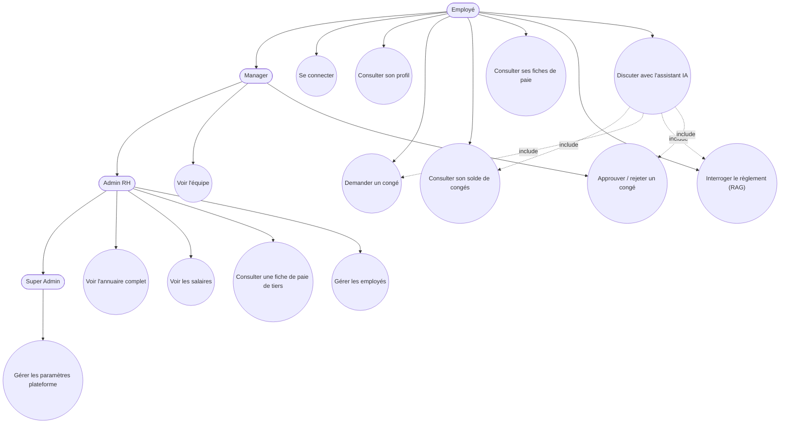
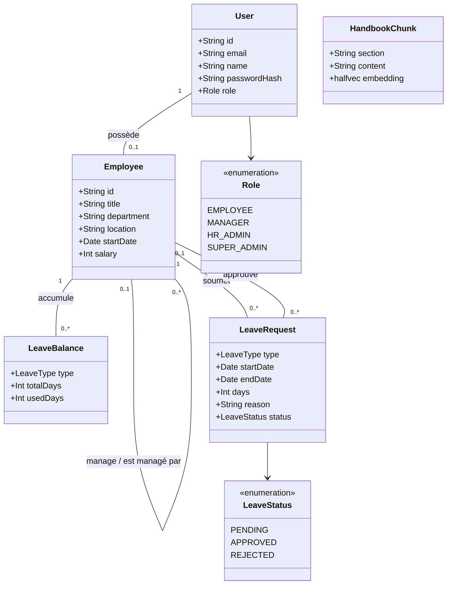
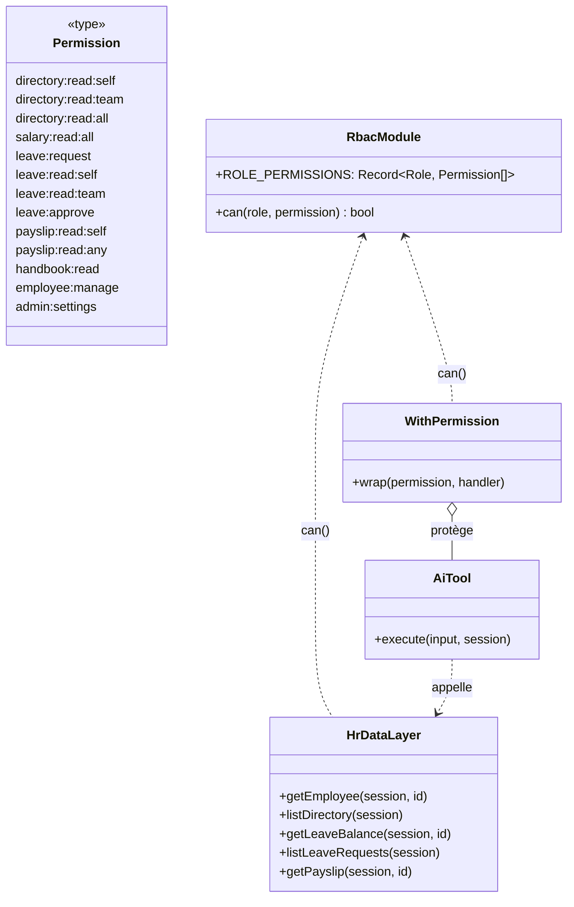
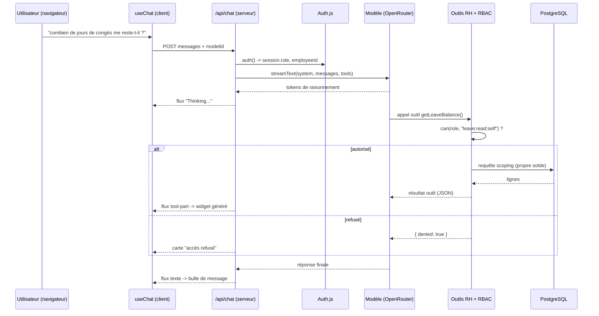
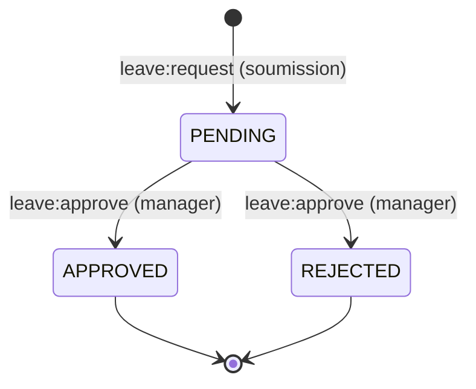
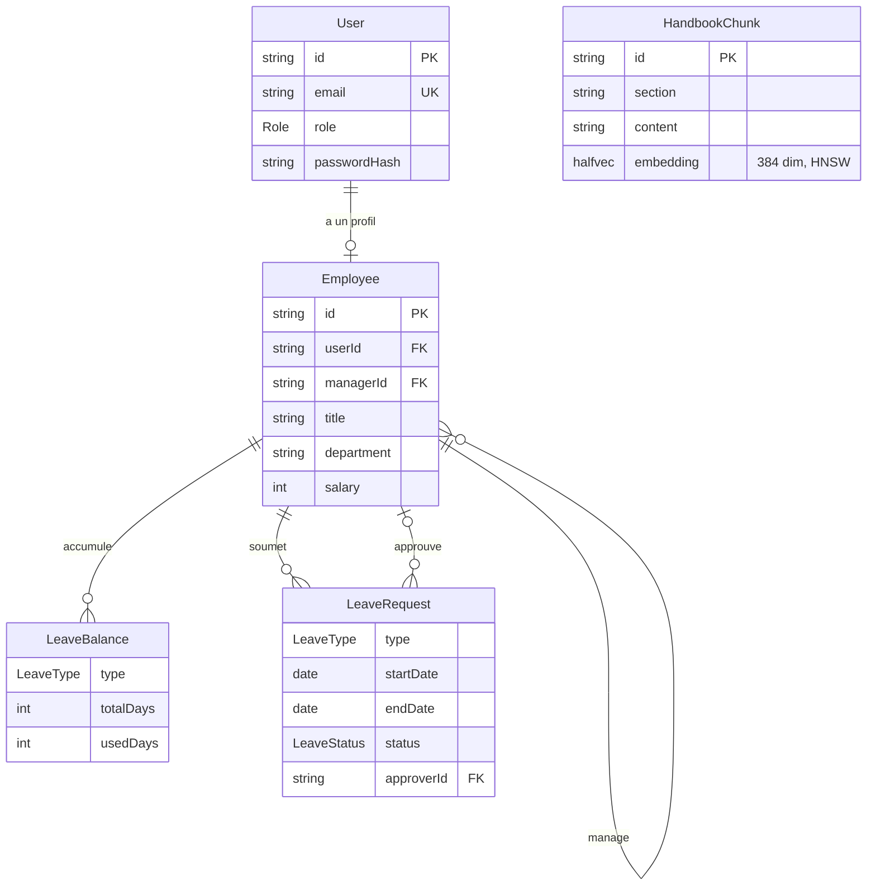
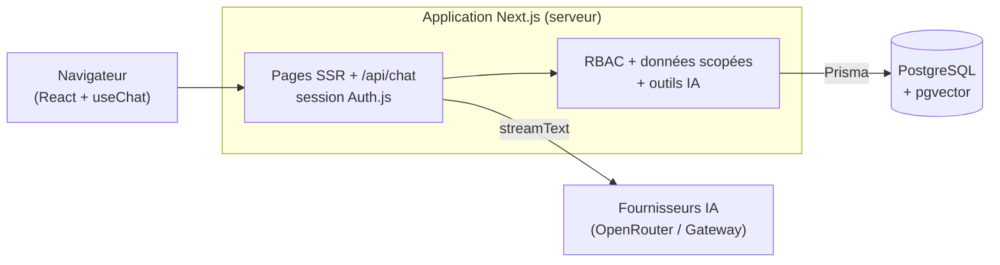

# Phase 3 — Conception (UML)

Cette phase formalise la conception issue des besoins (phase 2) sous forme de diagrammes UML.
Les sources des diagrammes sont en Mermaid (rendu natif sur GitHub/GitLab).

## 1. Diagramme de cas d'utilisation

> Chaque cas d'utilisation déclenché via le chat (UC7) repasse par les **mêmes vérifications de
> permission** que son équivalent UI — l'assistant IA n'est qu'une nouvelle porte d'entrée vers les
> cas d'utilisation existants, jamais un chemin parallèle.

## 2. Diagramme de classes (domaine)

`HandbookChunk` est volontairement isolé : c'est le corpus du RAG, sans clé étrangère vers le
domaine RH.

## 3. Diagramme de classes (logique RBAC)

`lib/rbac.ts` est la source unique consultée par la couche données (`lib/hr.ts`) **et** par les
outils IA (`lib/ai/tools.ts` via `withPermission`) — garantissant que le chatbot ne peut jamais lire
plus de données que l'UI ne le permettrait pour le même rôle.

## 4. Diagramme de séquence — message de chat avec appel d'outil

## 5. Diagramme d'états — cycle de vie d'une demande de congé

## 6. Modèle de données (ERD)

## 7. Architecture en couches

Voir la suite : [Phase 4 — Planification (Jira)](../04-jira/jira.md).
