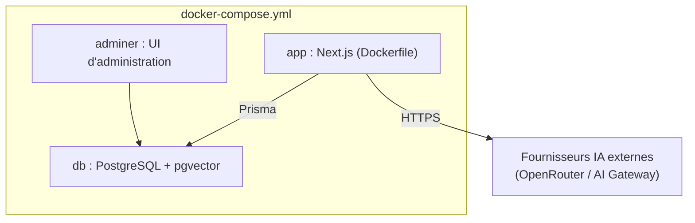

# Phase 7 — Déploiement

## Environnements

| Environnement | Commande | Description |
|---|---|---|
| Démo / développement (Docker) | `docker compose up --build` | Démarre PostgreSQL+pgvector, Adminer (`:8080`) et l'app (`:3000`). Applique les migrations et seed automatiquement au boot |
| Développement local (sans Docker) | `npm install` puis `docker compose up -d db` puis `npm run db:deploy && npm run db:seed` puis `npm run dev` | Utile pour un cycle de développement rapide avec hot-reload |

## Variables d'environnement (`.env`)

| Variable | Nécessaire pour | Remarque |
|---|---|---|
| `OPENROUTER_API_KEY` | Chat et embeddings RAG | Gratuite sur openrouter.ai/keys ; alimente toute la démo |
| `AUTH_SECRET` | Sessions | Générée avec `npx auth secret` |
| `AI_GATEWAY_API_KEY` | Optionnel | Active les modèles du Vercel AI Gateway dans le sélecteur |

## Gestion du schéma

- Toute évolution du schéma passe par `prisma/schema.prisma` puis `npm run db:migrate` (génère une
  migration), commit du SQL généré sous `prisma/migrations/`.
- `npm run db:reset` reconstruit la base de dev depuis zéro (migrations + seed) — utile après une
  modification du règlement intérieur (`prisma/handbook.ts`), car le seed ne réembarque pas le
  contenu si les chunks existent déjà.
- `npm run db:deploy` applique les migrations en environnement de type production/CI sans
  régénérer de nouvelle migration.

## Comptes de démonstration (mot de passe `password123`)

| Rôle | Email | Peut faire |
|---|---|---|
| Employé | `employee@acme.test` | Profil propre, congés/paie propres, interroger le règlement |
| Manager | `manager@acme.test` | + voir l'équipe, approuver ses congés |
| Admin RH | `hr@acme.test` | + toute l'entreprise, salaires, n'importe quelle fiche de paie |
| Super Admin | `admin@acme.test` | + paramètres plateforme |

## Avant une mise en production réelle

Ce starter assume des raccourcis pédagogiques à corriger avant tout déploiement public :

1. Remplacer le mot de passe partagé des comptes de démo par une politique de mots de passe réelle.
2. Générer et faire tourner un `AUTH_SECRET` propre à l'environnement (jamais celui du dépôt).
3. Construire une image Docker de production (multi-stage, sans outils de dev).
4. Mettre en place une rotation des secrets (`OPENROUTER_API_KEY`, `AI_GATEWAY_API_KEY`, `DATABASE_URL`).
5. Activer des sauvegardes régulières de la base PostgreSQL (les données RH sont sensibles).
6. Revoir les CORS / en-têtes de sécurité des Route Handlers (`app/api/**`) pour un déploiement public.

## Pile d'infrastructure

