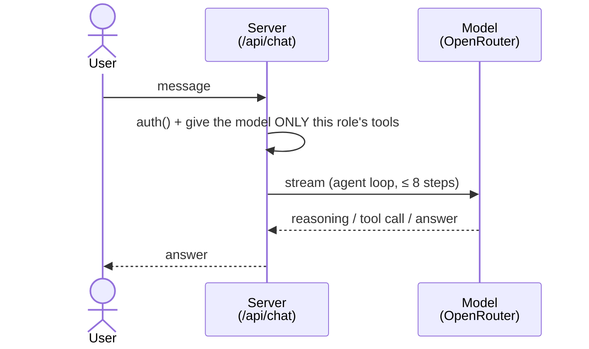

# Authorized AI chat sequence

> Jira: HARI-111 · Parent: HARI-2 (Architecture)
>
> One chat turn on the `/chat` page: a small diagram for the order of events, and a
> table for what each tool call is allowed to do.

This is the detailed companion to the simplified diagram in the
[README](../../README.md#what-happens-when-you-send-a-chat-message). The handbook RAG
sub-flow has its own doc, *HR Handbook RAG — Architecture*
(`docs/architecture/hr-rag-architecture.md`, HARI-113), so it isn't expanded here.

## One turn, end to end

The server authenticates first. With no session it returns `401` before any model
call. It then builds the role's toolset (and lists those tools in the system
prompt), streams the model, and loops (reason, call a tool, answer) until done.

## What a tool call is allowed to do

The model is only ever handed the tools its role may use. Each tool also re-checks
the role and scopes the target **before** any database access:

| The tool call… | Result |
|---|---|
| is for in-scope data | role-scoped read (salary redacted unless `salary:read:all`) → a UI card |
| targets something out of scope | `{ refused }`, no DB access, nothing rendered; the agent works with the data it's allowed to see |
| isn't permitted for the role at all | not offered in the first place, so the model can't call it |

## Walkthrough

### Authorization gate

The Route Handler's **first** action is `auth()`. With no valid session it returns
`401 Unauthorized` and the turn ends before any model call, so chat is never served
to an unauthenticated caller. On success it reads `role`, `employeeId`, and `name`
from the session. The client never supplies the role, so it can't be forged
(`src/app/api/chat/route.ts`).

### Capability-scoped system prompt

The handler lists the role's **tools** (each tool's name and summary, taken from the
same `TOOL_CATALOGUE` used to build the toolset) in the system prompt, so the agent
knows exactly what it can do, and the prompt can never advertise a tool the role
wasn't given. This is for UX, not enforcement: the server re-checks every tool call
(below).

### Streaming generation with tools

`streamText` is called with the assembled `system` prompt, the converted message
history, the role's tool set from `buildHrTools(caller)`, and a hard stop of
`stepCountIs(8)`. The response is returned via `toUIMessageStreamResponse({
sendReasoning: true })`, so reasoning, tool calls, tool results, and answer text all
stream to the client as typed UI-message parts.

### The agent loop (≤ 8 steps)

Each step the model may **(a)** emit reasoning tokens (surfaced from any
`<think>…</think>` block by `extractReasoningMiddleware` in
`src/lib/ai/providers.ts`) into the collapsible "Thinking…" panel, **(b)** call a
tool, or **(c)** produce the final answer. After a tool result is fed back, the loop
continues. That is what enables **multi-step** chains, for example checking the leave
balance and then submitting the request. The `stepCountIs(8)` cap bounds the loop so
a model can't spin indefinitely.

### Per-role tools + per-tool authorization

The toolset is filtered up front: `buildHrTools(caller)` advertises **only** the
tools the role may use (driven by `TOOL_CATALOGUE`), so an out-of-scope tool is never
offered and the model can't attempt it. Each tool's `execute` still re-checks
`can(role, permission)` **before** touching the database (`src/lib/ai/tools.ts`), as
defense in depth. The branches:

- **Refused.** The target is out of scope (another team's request, say). Non-elevated
  roles can't even ask for another's payslip, because the parameter is dropped from
  their schema. The tool returns `{ refused, message }` with no DB access, the UI
  renders nothing, and the model works with the authorized data. Tools fail closed,
  with no card.
- **Handbook (RAG).** `searchHandbook` embeds the query via OpenRouter (`embedText`,
  384-dim) and runs a pgvector cosine search; results stream into the **citations**
  widget. The dedicated *HR Handbook RAG architecture* doc covers this
  (`docs/architecture/hr-rag-architecture.md`, HARI-113).
- **Read via the shared data layer.** The directory and leave reads
  (`getEmployeeDirectory`, `getLeaveBalance`, `listPendingApprovals`) go through
  `lib/hr.ts`, the single role-scoped data layer shared with the dashboard pages. Its
  `WHERE` clauses scope rows by role (self, team, or company) and **redact salary**
  unless the caller holds `salary:read:all`, so the chatbot can never surface more
  than the UI would.
- **Payslip and write tools.** `getPayslip`, `requestTimeOff`, and `approveLeave`
  query Prisma directly (not via `lib/hr.ts`), each with its own `can()` check.
  `getPayslip` picks its permission at call time (`payslip:read:self` for your own,
  `payslip:read:any` for someone else's) instead of using a single `withPermission`
  wrapper, and derives the payslip from `employee.salary`, so it is **not** routed
  through the `salary:read:all` redaction in `lib/hr.ts`.

### Finalization

When the model emits answer text instead of a tool call, tokens stream into the
message bubble and render as Markdown (`src/components/chat/markdown.tsx`). For policy
questions the system prompt requires the answer to cite the handbook sections returned
by `searchHandbook`.

## Why this is "authorized" chat

Two enforcement points, both server-side:

1. **Transport gate.** `auth()` rejects unauthenticated requests with `401`.
2. **Capability gate.** Every tool re-checks `can(role, permission)` from the single
   matrix in `lib/rbac.ts` *before* any data access, and the data layer re-scopes and
   redacts on top of that.

The model is told the role's permissions only for better UX (it can explain a
refusal). A jailbroken or confused model still cannot exceed the role, because the
server enforces the matrix regardless. This mirrors the "Security measures" section of
the [README](../../README.md#security-measures).

## Failure & edge cases

| Case | Behavior |
|---|---|
| No session | `401 Unauthorized`; no model call. |
| Tool not permitted for role | Not advertised; `buildHrTools` never injects it, so the model can't call it. |
| Target out of scope (another team's request) | `{ refused }` (no DB hit); the UI shows nothing and the agent works with authorized data. |
| Handbook search unavailable (missing embedding key / unseeded) | `searchHandbook` catches the error and returns `{ results: [], error }`, so the turn degrades gracefully instead of throwing. |
| Model loops on tools | Bounded by `stopWhen: stepCountIs(8)`. |
| Reasoning-only steps | Streamed to the "Thinking…" panel via `sendReasoning: true`. |

## Source map

| Concern | File |
|---|---|
| Request handling, auth gate, system prompt, `streamText` | `src/app/api/chat/route.ts` |
| Client stream consumption / UI | `src/components/chat/chat.tsx`, `message.tsx`, `reasoning.tsx`, `tool-call.tsx` |
| Generative widgets | `src/components/chat/generative/{directory,leave,payslip,citations}.tsx` |
| Tools + per-tool permission wrapper | `src/lib/ai/tools.ts` |
| Permission matrix + `can()` | `src/lib/rbac.ts` |
| Role-scoped data access + redaction | `src/lib/hr.ts` |
| RAG retrieval | `src/lib/rag.ts`, `src/lib/ai/embeddings.ts` |
| Model registry + reasoning middleware | `src/lib/ai/providers.ts` |

## Related

- **Companion:** *HR Handbook RAG — Architecture* (HARI-113),
  `docs/architecture/hr-rag-architecture.md` (added in its own PR).
- [README — Architecture](../../README.md#architecture)
