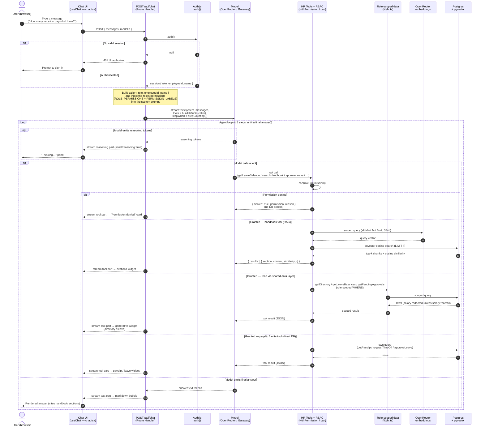

# Authorized AI chat — sequence diagram

> Jira: HARI-111 · Parent: HARI-2 (Architecture)
>
> One chat turn on the `/chat` page, traced end to end, with the authorization
> path made explicit: the session gate, the per-tool permission check, the
> role-scoped data access, and the RAG sub-flow.

This is the detailed companion to the simplified *"What happens when you send a
chat message"* diagram in the [README](../../README.md#what-happens-when-you-send-a-chat-message).
It shows what the README leaves out: the `401` gate, how the role's permissions
reach the system prompt, the permission-denied branch, the embeddings call inside
RAG, and the multi-step tool loop.

## Participants

| Participant | Runs where | Source |
|---|---|---|
| **User (browser)** | Client | — |
| **Chat UI** (`useChat`) | Client | `src/components/chat/chat.tsx` |
| **`POST /api/chat`** (Route Handler) | Server | `src/app/api/chat/route.ts` |
| **Auth.js** (`auth()`) | Server | `src/lib/auth.ts`, `src/lib/session.ts` |
| **Model** (OpenRouter / Gateway) | External | `src/lib/ai/providers.ts` |
| **HR Tools + RBAC** (`buildHrTools` / `withPermission` / `can`) | Server | `src/lib/ai/tools.ts`, `src/lib/rbac.ts` |
| **Role-scoped data** (`lib/hr.ts`) | Server | `src/lib/hr.ts` |
| **OpenRouter embeddings** | External | `src/lib/ai/embeddings.ts` |
| **Postgres + pgvector** | Server | `prisma/` |

## Sequence

## Walkthrough

### 1. Authorization gate (steps 3–6)

The Route Handler's **first** action is `auth()`. With no valid session it returns
`401 Unauthorized` and the turn ends before any model call — chat is never served
to an unauthenticated caller. On success it reads `role`, `employeeId`, and `name`
from the session; **the client never supplies the role**, so it can't be forged
(`src/app/api/chat/route.ts`).

### 2. Permission-scoped system prompt (step 7)

The handler looks up the caller's permissions from `ROLE_PERMISSIONS[role]`, maps
them to human labels via `PERMISSION_LABELS`, and lists them in the system prompt.
This is defense in depth. Telling the model the rules helps it explain itself, but
the prompt never enforces anything; the server re-checks every tool call (below).

### 3. Streaming generation with tools (step 8)

`streamText` is called with the assembled `system` prompt, the converted message
history, the role's tool set from `buildHrTools(caller)`, and a hard stop of
`stepCountIs(5)`. The response is returned via `toUIMessageStreamResponse({
sendReasoning: true })`, so reasoning, tool calls, tool results, and answer text
all stream to the client as typed UI-message parts.

### 4. The agent loop (≤ 5 steps)

Each step the model may **(a)** emit reasoning tokens (surfaced from any
`<think>…</think>` block by `extractReasoningMiddleware` in
`src/lib/ai/providers.ts`) into the collapsible "Thinking…" panel, **(b)** call a
tool, or **(c)** produce the final answer. After a tool result is fed back, the
loop continues — this is what enables **multi-step** chains (e.g. *check leave
balance → submit request*). The `stepCountIs(5)` cap bounds the loop so a model
can't spin indefinitely.

### 5. Per-tool authorization

Every tool's `execute` is wrapped by `withPermission(caller, permission, fn)`,
which calls `can(role, permission)` **before** touching the database
(`src/lib/ai/tools.ts`):

- **Denied** → returns a structured `{ denied: true, permission, reason }` with no
  DB access; the UI renders a *"permission denied"* card (`generative/denied.tsx`)
  and the model politely explains the limitation. Tools **fail closed**.
- **Granted — handbook (RAG)** → `searchHandbook` embeds the query via OpenRouter
  (`embedText`, 384-dim) and runs a pgvector cosine search; results stream into the
  **citations** widget. See the dedicated *HR Handbook RAG architecture*
  (`docs/architecture/hr-rag-architecture.md`, HARI-113).
- **Granted — read via shared data layer** → the directory and leave reads
  (`getEmployeeDirectory`, `getLeaveBalance`, `listPendingApprovals`) go through
  `lib/hr.ts`, the *single* role-scoped data layer shared with the dashboard pages.
  Its `WHERE` clauses scope rows by role (self / team / company) and **redact salary**
  unless the caller holds `salary:read:all`, so the chatbot can never surface more than
  the UI would.
- **Granted — payslip / write tool** → `getPayslip`, `requestTimeOff`, and
  `approveLeave` query Prisma directly (not via `lib/hr.ts`), each with its own
  `can()` check. `getPayslip` in particular picks its permission at call time
  (`payslip:read:self` for your own, `payslip:read:any` for someone else's) rather than
  via a single `withPermission` wrapper, and derives the payslip from `employee.salary`
  — it is **not** routed through the `salary:read:all` redaction in `lib/hr.ts`.

### 6. Finalization

When the model emits answer text instead of a tool call, tokens stream into the
message bubble and render as Markdown (`src/components/chat/markdown.tsx`). For
policy questions the system prompt requires the answer to cite the handbook
sections returned by `searchHandbook`.

## Authorization model (why this is "authorized" chat)

Two enforcement points, both server-side:

1. **Transport gate** — `auth()` rejects unauthenticated requests with `401`.
2. **Capability gate** — every tool re-checks `can(role, permission)` from the
   single matrix in `lib/rbac.ts` *before* any data access, and the data layer
   re-scopes/redacts on top of that.

The model is informed of the role's permissions only to produce better UX
(it can explain a denial); a jailbroken or confused model still cannot exceed the
role, because the **server** enforces the matrix regardless. This mirrors the
"Security measures" section of the [README](../../README.md#security-measures).

## Failure & edge cases

| Case | Behavior |
|---|---|
| No session | `401 Unauthorized`; no model call. |
| Tool not permitted for role | `{ denied: true }` (no DB hit) → denied card; model explains. |
| Handbook search unavailable (missing embedding key / unseeded) | `searchHandbook` catches and returns `{ results: [], error }` so the turn degrades gracefully instead of throwing. |
| Model loops on tools | Bounded by `stopWhen: stepCountIs(5)`. |
| Reasoning-only steps | Streamed to the "Thinking…" panel via `sendReasoning: true`. |

## Source map

| Concern | File |
|---|---|
| Request handling, auth gate, system prompt, `streamText` | `src/app/api/chat/route.ts` |
| Client stream consumption / UI | `src/components/chat/chat.tsx`, `message.tsx`, `reasoning.tsx`, `tool-call.tsx` |
| Generative widgets | `src/components/chat/generative/{directory,leave,payslip,citations,denied}.tsx` |
| Tools + per-tool permission wrapper | `src/lib/ai/tools.ts` |
| Permission matrix + `can()` | `src/lib/rbac.ts` |
| Role-scoped data access + redaction | `src/lib/hr.ts` |
| RAG retrieval | `src/lib/rag.ts`, `src/lib/ai/embeddings.ts` |
| Model registry + reasoning middleware | `src/lib/ai/providers.ts` |

## Related

- **Companion:** *HR Handbook RAG — Architecture* (HARI-113) →
  `docs/architecture/hr-rag-architecture.md` (added in its own PR).
- [README — Architecture](../../README.md#architecture)
