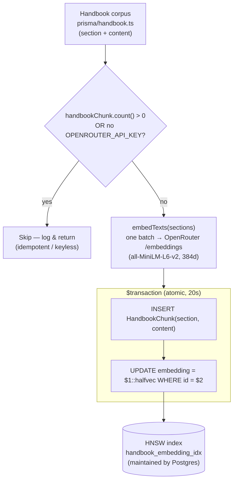
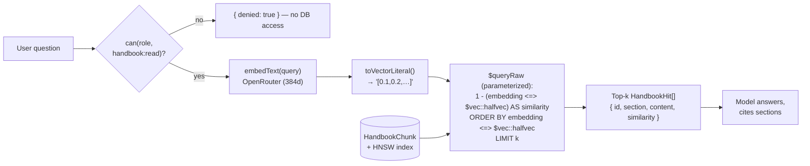

# HR handbook RAG — architecture

> Jira: HARI-113 · Parent: HARI-2 (Architecture)
>
> How the assistant answers HR-policy questions from the employee handbook: the
> indexing (seed-time) pipeline, the retrieval (query-time) pipeline, the storage
> model (`halfvec(384)` + HNSW), and the operational rules around them.

This is the detailed companion to the [README RAG pipeline
section](../../README.md#rag-pipeline-handbook-search). For how retrieval plugs
into a chat turn (permission gate, citations widget, streaming), see the
companion *Authorized AI chat sequence* (`docs/architecture/authorized-ai-chat-sequence.md`, HARI-111).

## Why RAG here

The handbook is a small, slow-changing body of policy text. Instead of fine-tuning
or pasting the whole handbook into every prompt, the assistant retrieves the few
sections most relevant to each question and answers from them, citing each by name.
Answers stay accurate and easy to audit, and retrieval reuses the same Postgres that
holds the relational HR data, so there is no separate vector store to run.

## Components

| Concern | What | Source |
|---|---|---|
| Corpus | Plain-text handbook sections (`{ section, content }[]`) | `prisma/handbook.ts` |
| Embeddings | OpenRouter `/embeddings`, env-selectable model, fixed 384-dim | `src/lib/ai/embeddings.ts` |
| Storage | `HandbookChunk.embedding` as pgvector `halfvec(384)` | `prisma/schema.prisma`, `prisma/migrations/0_init/migration.sql` |
| Index | HNSW with `halfvec_cosine_ops` | `prisma/migrations/0_init/migration.sql` |
| Indexing | Batch-embed + atomic insert at seed time | `prisma/seed.ts` (`seedHandbook`) |
| Retrieval | Cosine search returning top-k + similarity | `src/lib/rag.ts` (`searchHandbook`) |
| Tool surface | `searchHandbook` tool, gated by `handbook:read` | `src/lib/ai/tools.ts` |
| Presentation | Citations rendered inline | `src/components/chat/generative/citations.tsx` |

## Data model

```prisma
enum DocStatus     { DRAFT PUBLISHED ARCHIVED }
enum DocVisibility { ALL_EMPLOYEES MANAGERS HR_ONLY }

model KbCollection { id  slug @unique  name  description?  order  documents HrDocument[] }

model HrDocument {                       // HARI-58
  id  slug @unique  title  content       // content = markdown source of truth
  status     DocStatus     @default(DRAFT)
  visibility DocVisibility @default(ALL_EMPLOYEES)
  version    Int           @default(1)   // bumped each publish (HARI-59)
  collection KbCollection  @relation(...)
  chunks     HandbookChunk[]
  publishedAt DateTime?
}

model HandbookChunk {                    // HARI-59: now attached to its document
  id        String                       @id @default(cuid())
  section   String                       // heading text
  anchor    String                       // heading slug → citation deep-link
  content   String
  chunkIndex Int                         // order within the document
  embedding Unsupported("halfvec(384)")?
  document   HrDocument?  @relation(...)  // documentId FK, onDelete: Cascade
  version    Int                          // snapshot of the doc's version
  visibility DocVisibility                // denormalized for fast filtered retrieval
  createdAt DateTime                      @default(now())
}
```

The KB is **collections → documents → chunks** (`prisma/handbook.ts` is the seed
corpus). Only **PUBLISHED** documents are chunked & embedded
(`src/lib/kb/ingest.ts`), so DRAFT/ARCHIVED docs have **zero** chunks and are
invisible to the chatbot. Each chunk denormalizes the document's `visibility` tier
and the `anchor` of its heading. Retrieval (`src/lib/rag.ts`) filters
`status='PUBLISHED' AND visibility = ANY(visibleDocTiers(caller.role)) AND
COALESCE(doc, collection).assistantEnabled` — the last clause is the super-admin
*assistant-access* policy (additive-only; see `knowledge-base.md`). So a tool
can never surface a draft, an archived doc, one above the caller's tier, or content
a super admin has withheld from the assistant — and
returns the article/collection slug + anchor so a citation can deep-link to the
exact section (`/kb/{collection}/{article}#{anchor}`). Prisma can't model the
pgvector type or an index on it, so `embedding` is declared
`Unsupported("halfvec(384)")` and the real column type **and** the HNSW index live
in the migration SQL:

```sql
-- prisma/migrations/0_init/migration.sql
CREATE EXTENSION IF NOT EXISTS vector;                       -- pgvector (>= 0.7 for halfvec)
-- HandbookChunk.embedding halfvec(384)
CREATE INDEX "handbook_embedding_idx"
  ON "HandbookChunk" USING hnsw (embedding halfvec_cosine_ops);
```

> The extension is also created on a fresh Postgres volume via
> `docker/db-init/01-extensions.sql`, so a first `docker compose up` has `vector`
> available before migrations run.

### Why `halfvec(384)` + HNSW + cosine

- **`halfvec`** stores 16-bit floats — **half** the size of `vector` (32-bit) for a
  negligible recall cost at this scale.
- **384 dims** matches the default embedding model (`all-MiniLM-L6-v2`). The
  dimension is part of the schema; see [Changing the embedding model](#changing-the-embedding-model).
- **HNSW** gives fast approximate nearest-neighbor search; `halfvec_cosine_ops`
  makes the index serve the cosine operator `<=>` used by the query.

## Indexing pipeline (seed time)

Run by `npm run db:seed` (`seedHandbook` in `prisma/seed.ts`). It is **idempotent**
and **atomic**:



Key properties (all in `seedHandbook`):

- **Idempotent** — if `HandbookChunk` already has rows, seeding skips. So a plain
  re-seed won't duplicate or re-embed; **after editing `handbook.ts` you must
  `npm run db:reset`** (drop + migrate + re-seed) to pick up the changes.
- **Keyless-safe** — with no `OPENROUTER_API_KEY` it logs a warning and skips
  embedding; the app still boots, and RAG simply returns nothing until you add the
  key and re-seed.
- **Atomic** — inserts + embedding updates run inside one `$transaction`, so a
  mid-batch failure rolls back instead of leaving a *partial* corpus that the
  `count() > 0` guard would then skip forever.
- **Batched** — all sections are embedded in a single `embedTexts` call rather than
  one request per section.
- The embedded text for each chunk is `"${section}\n${content}"`, so the section
  title contributes to the vector.

## Retrieval pipeline (query time)

> Retrieval is now **hybrid** — pgvector semantic search fused with Postgres
> full-text (lexical) search via Reciprocal Rank Fusion, both filtered by the
> caller's access tier + `PUBLISHED` status. See
> [Knowledge Base — architecture › Hybrid retrieval](./knowledge-base.md#hybrid-retrieval-vector--lexical--rrf).
> The diagram below shows the original semantic-only path; the lexical half and RRF
> fusion are layered on in `src/lib/rag.ts`.

`searchHandbook(query, k, caller)` in `src/lib/rag.ts`, invoked by the
`searchHandbook` tool (after the `handbook:read` permission check):



The actual query (`src/lib/rag.ts`):

```sql
SELECT id, section, content,
       1 - (embedding <=> $vec::halfvec) AS similarity
FROM "HandbookChunk"
ORDER BY embedding <=> $vec::halfvec
LIMIT k
```

- `<=>` is pgvector's **cosine distance**; `ORDER BY ... <=>` uses the HNSW index.
- Returned **`similarity = 1 - distance`** (1 = identical, 0 = unrelated) is exposed
  for display/citations.
- The query vector is bound as a **text parameter** and cast (`$vec::halfvec`) — no
  string interpolation, so the raw query stays injection-safe.
- Default `k = 4` from `rag.ts`; the chat tool requests `4`.

## Tool integration & failure handling

The `searchHandbook` tool (`src/lib/ai/tools.ts`) wraps retrieval with the
`handbook:read` permission (held by **every** role) and degrades gracefully:

```ts
execute: withPermission(caller, "handbook:read", async ({ query }) => {
  try {
    const results = await searchHandbook(query, 4);
    return { query, results };
  } catch {
    // Most likely: no embedding key configured, or handbook not seeded.
    return { query, results: [], error: "Handbook search is unavailable …" };
  }
});
```

So a missing key or unseeded corpus yields an empty, explained result instead of a
thrown error mid-stream. The system prompt instructs the model to answer policy
questions **only** from returned sections and to cite them.

## Changing the embedding model

The model is env-selectable; the **dimension is not** — it's baked into the column
and index.

| Want to… | Do this |
|---|---|
| Swap to another **384-dim** model | Set `EMBEDDING_MODEL`, then `npm run db:reset` to re-embed. No migration. |
| Use a model with a **different** dimension (e.g. 768/1024/1536) | Add a migration that `ALTER`s the column to the new `halfvec(N)` and rebuilds the HNSW index, update `EMBEDDING_DIMENSIONS` in `embeddings.ts`, then `db:reset`. |

`embed()` validates the provider's response shape and **fails loudly** if the
returned vector width ≠ `EMBEDDING_DIMENSIONS`, so a model/column mismatch surfaces
as a clear error instead of a silent corruption. Reference widths:
`all-MiniLM-L6-v2 = 384`, `bge-base-en-v1.5 = 768`, `bge-m3 = 1024`,
`text-embedding-3-small = 1536`.

## Operational notes

- **Edit the handbook** → `prisma/handbook.ts`, then `npm run db:reset` (the seed
  skips when chunks already exist).
- **Verify retrieval** → `tests/rag.live.test.ts` embeds *"what is the parental
  leave policy?"* and asserts the top hit is the parental-leave section with
  similarity > 0.4 (needs a key + a seeded DB). See the README
  [Testing](../../README.md#testing) section for how to run the live suites.
- **One key, whole demo** → the same `OPENROUTER_API_KEY` powers chat *and*
  embeddings.

## Source map

| Concern | File |
|---|---|
| Seed corpus (collections → documents) | `prisma/handbook.ts` |
| Markdown chunker + shared heading slugger | `src/lib/kb/markdown.ts` |
| Indexing pipeline (chunk + embed on publish) | `src/lib/kb/ingest.ts` |
| Role-scoped KB data layer (reader + admin CRUD) | `src/lib/kb.ts` |
| Embeddings client + dimension guard | `src/lib/ai/embeddings.ts` |
| Schema (collections, documents, halfvec chunks) | `prisma/schema.prisma` |
| Column type, extension, HNSW index | `prisma/migrations/0_init/migration.sql`, `…_add_knowledge_base/migration.sql` |
| Indexing (seed) | `prisma/seed.ts` |
| Retrieval (status + tier filtered) | `src/lib/rag.ts` |
| Visibility tiers per role | `src/lib/rbac.ts` (`visibleDocTiers`) |
| Tool + permission gate + graceful failure | `src/lib/ai/tools.ts` |
| Citations UI (linked sources + inline `[n]`) | `src/components/chat/generative/citations.tsx`, `src/components/chat/citations-rehype.ts` |
| Reader + admin pages | `src/app/(dashboard)/kb/**`, `src/components/kb/**` |
| Tests (RBAC tiers, status gating, IDOR) | `tests/kb.integration.test.ts`, `tests/rag.live.test.ts` |

## Related

- **Companion:** *Authorized AI chat — sequence diagram* (HARI-111) →
  `docs/architecture/authorized-ai-chat-sequence.md` (added in its own PR).
- [README — RAG pipeline](../../README.md#rag-pipeline-handbook-search)
