# Knowledge Base: what each role can do

The Knowledge Base is HARI's HR document library. It is also the assistant's source of
truth: `/chat` answers handbook questions by retrieving these same documents, through the
same query, under the same access rules. There is no second copy of the content and no
second set of permissions.

This guide demonstrates what the four roles can actually do with it. Every screenshot was
taken from a running instance against the seeded demo data, signed in as the demo account
named in the caption.

## The short version

|                                       | Employee | Manager | HR Admin | Super Admin |
| ------------------------------------- | :------: | :-----: | :------: | :---------: |
| Collections visible in the reader     |    2     |    3    |    4     |      4      |
| Published articles readable           |    8     |    9    |    10    |     10      |
| Create, edit, publish, archive        |    no    |   no    |   yes    |     yes     |
| Decide what the assistant may use     |    no    |   no    |    no    |     yes     |

Two things in that table are worth stating plainly, because they are easy to assume
otherwise. HR Admin and Super Admin read exactly the same content; the only thing that
separates them is the assistant-access policy. And a Manager is not an administrator: the
extra collection they see is a reading permission, not an editing one.

## Three tiers, one rule

Every document carries one of three access tiers. A role's tier list is derived from what
that role may already see in the employee directory, so the library cannot drift away from
the rest of the app.

| Tier             | Employee | Manager | HR Admin | Super Admin |
| ---------------- | :------: | :-----: | :------: | :---------: |
| All employees    |   yes    |   yes   |   yes    |     yes     |
| Managers & above |    no    |   yes   |   yes    |     yes     |
| HR only          |    no    |   no    |   yes    |     yes     |

A document is readable when its tier is in the reader's list **and** it is published.
Both halves matter, and the second one is easy to forget: the seed ships a draft
(*Relocation Policy*) that no reader of any role can open, because drafts are never
published and never indexed.

## What a role sees

The same URL, `/kb`, signed in as three different people. The collection grid is not
filtered in the browser; collections with nothing visible are never sent.

Employee (Imane Chraibi) sees two collections, eight articles, and no management controls.

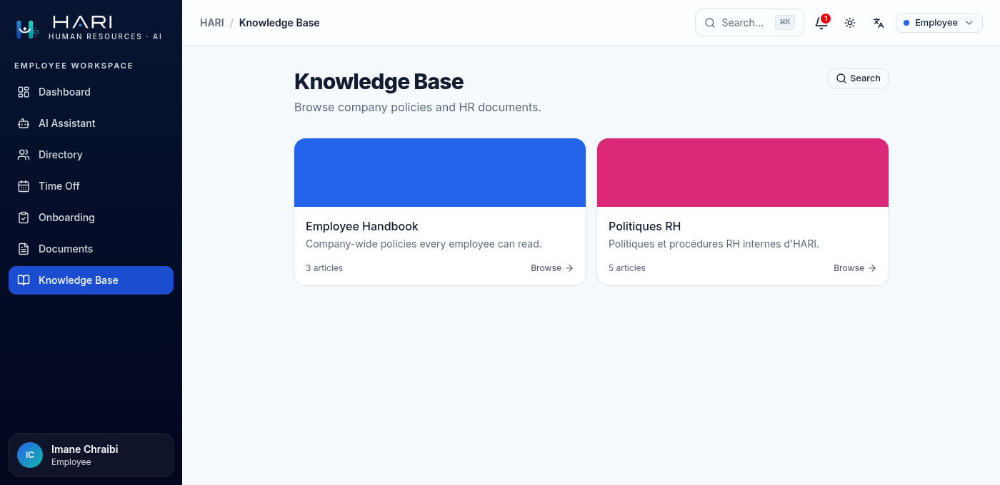

Manager (Karim El Idrissi) sees the same two, plus *Management*.

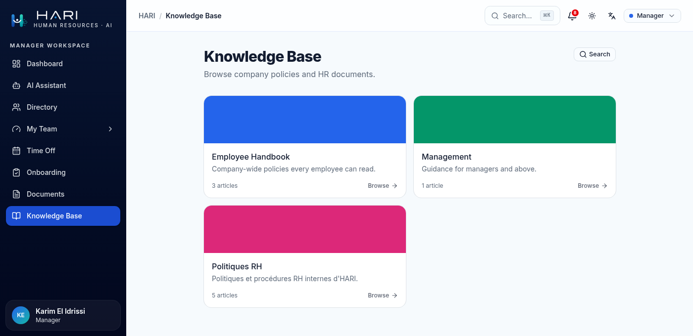

HR Admin (Nadia Benali) sees all four, and gains a *Manage* button next to *Search*.

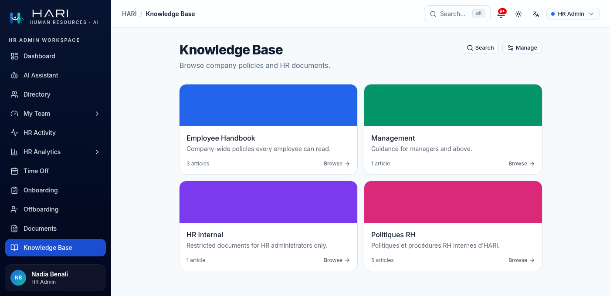

## Restricted content is invisible, not forbidden

Knowing that a document exists is itself a leak. A restricted URL therefore returns an
ordinary 404 rather than a "denied" page, so a guessed address cannot be used to probe for
content. Not-found, unpublished, and above-your-tier are deliberately indistinguishable.

`/kb/management` as an Employee returns 404. As a Manager, the same URL returns the
collection, and the article carries a *Managers & above* badge.

<table>
<tr>
<td width="50%">
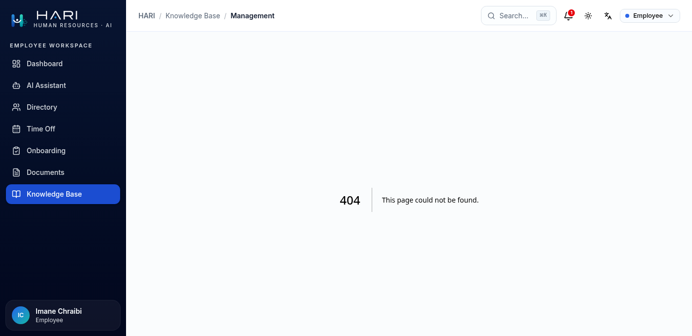
<em>Employee: the collection does not exist, as far as this account can tell.</em>
</td>
<td width="50%">
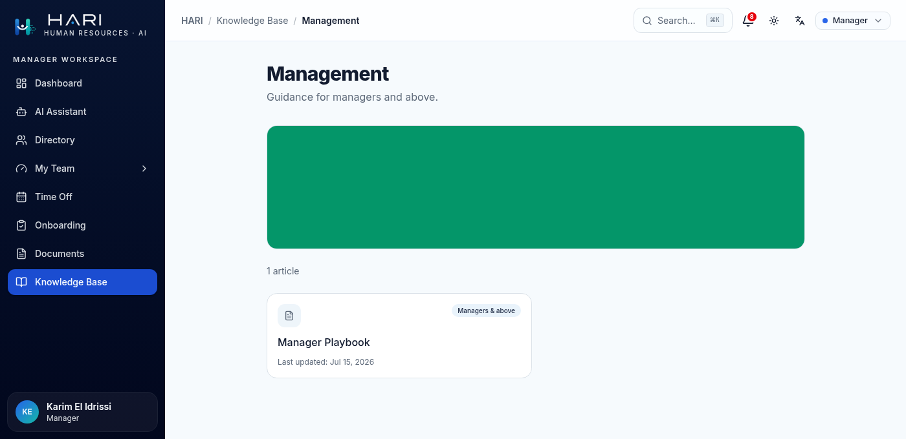
<em>Manager: the same URL, now readable and tier-badged.</em>
</td>
</tr>
</table>

Badges only appear above the default tier, so an Employee never sees one at all. HR Admin
sees the *HR only* badge on *Compensation Bands*, in the collection a Manager cannot open.

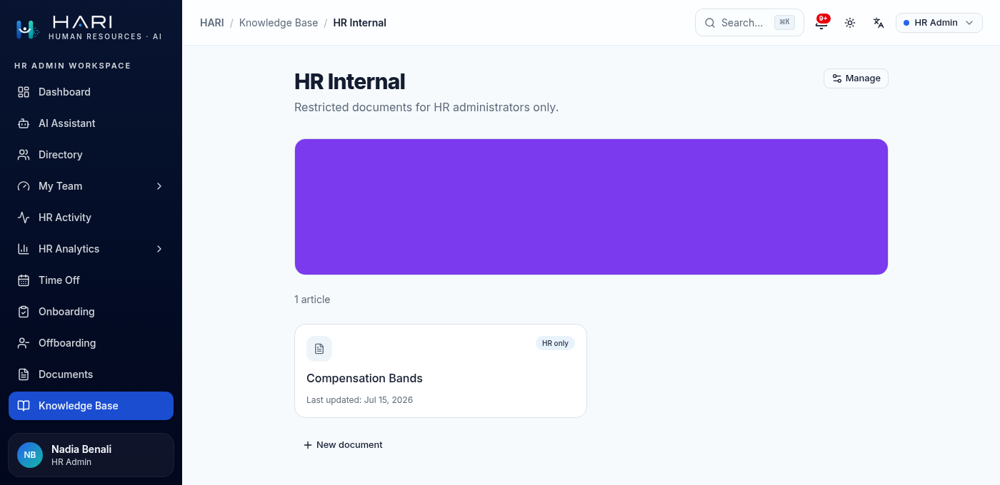

## Reading an article

The reader shows the title, author, last-updated date, reading time, and a table of
contents built from the article's own headings. Those headings are also the anchors the
assistant cites, which is what lets a chat answer link to an exact section rather than to
the page.

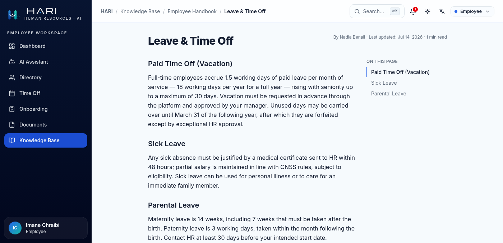

## Search is gated by the same rule

Search is not a keyword filter over what the page already loaded. It runs the retrieval
query on the server, scoped to the caller, and returns section-level hits that link
straight to an anchor.

The clearest way to see the tier gate is to run one query as two roles. Both searched
`approving leave coverage balance`. The Manager's top hit is *Approving Leave* from the
*Manager Playbook*. The Employee's list is the same list with that row removed, and
everything below it ranked identically. There is no placeholder and no "restricted"
message, because the row was never a candidate.

<table>
<tr>
<td width="50%">
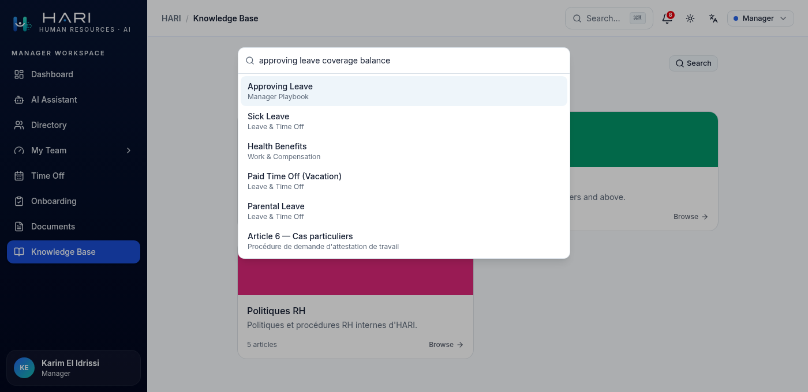
<em>Manager: Approving Leave, from the Manager Playbook, ranks first.</em>
</td>
<td width="50%">
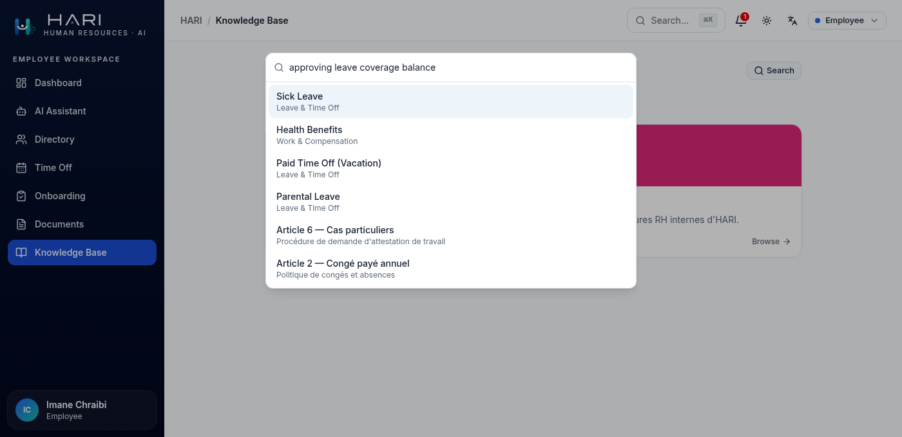
<em>Employee: the same query, the same ranking, that first row absent.</em>
</td>
</tr>
</table>

## Managing the library

`Manage` is gated on `kb:manage`, which HR Admin and Super Admin hold. The admin table is
the only place where the library is visible in full: every status, every tier, including
the seeded draft that no reader can reach.

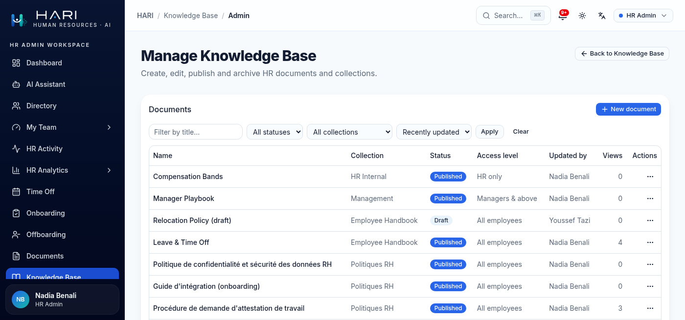

Documents are always created as drafts. Publishing is what splits the content into
chunks, embeds them, and makes them retrievable; unpublishing or archiving deletes those
chunks again. A draft has no chunks at all, so content that is not ready cannot reach the
assistant even by accident.

## Deciding what the assistant may use

This is the one Knowledge Base capability that belongs to Super Admin alone, behind
`admin:settings`. It answers a narrow question: of the content a person may already read,
what may the AI use when answering?

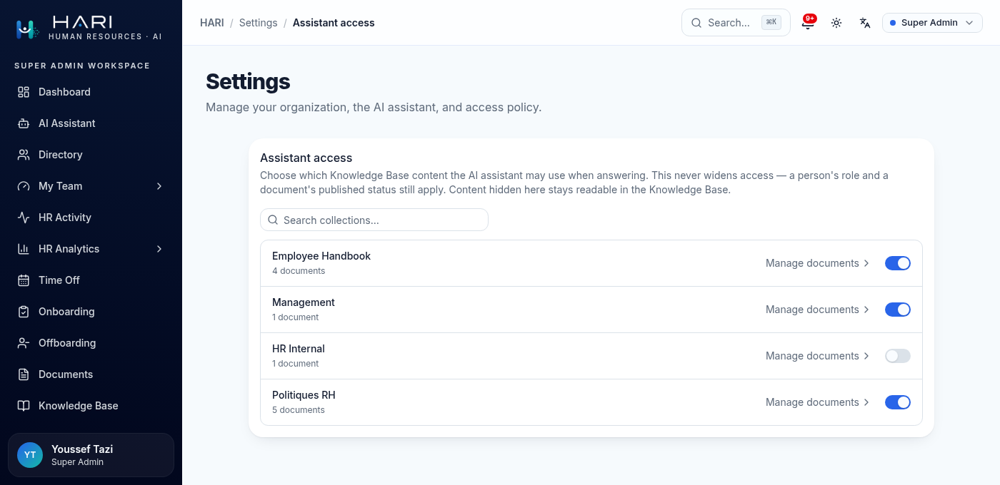

The seed ships *HR Internal* switched off to demonstrate this. The policy only ever takes
access away. Role and published status are applied first and are not negotiable here, so
switching a collection on cannot show anyone something their tier forbids; the switch can
only narrow what the assistant may draw on. Content hidden here stays readable in the
Knowledge Base, and stays findable by its search, because the policy governs the assistant
rather than the reader.

## Where the rules actually live

Worth being precise about, since it is the reason the demonstrations above hold rather
than merely appearing to.

The tier gate is part of the database query, not an instruction in a prompt and not a
filter in the browser. Retrieval is hybrid: a vector search over `pgvector` and a Postgres
full-text search, fused by reciprocal rank fusion, with the caller's tier list and the
published status applied as SQL conditions inside both halves. The reader, the search box,
and the assistant all enter through that one query. This is why the chatbot cannot answer
from a document the reader would refuse to show: not because it has been told not to, but
because those rows never come back.

Citations are built server-side from the database. The model receives numbered references
and emits `[1]`, and the link is assembled from the stored collection, article, and anchor.
A citation therefore cannot point at a document that was not retrieved.

For the schema, the retrieval SQL, and the enforcement contract, see
[`docs/architecture/knowledge-base.md`](../architecture/knowledge-base.md) and
[`docs/architecture/authorization-invariants.md`](../architecture/authorization-invariants.md).
The role and permission definitions themselves are in `src/lib/rbac.ts`.

## Reproducing this

Sign in with any demo account at `/login` (all use `password123`) and compare `/kb`:

| Account                 | Role        | Collections |
| ----------------------- | ----------- | :---------: |
| `collaborateur@hari.ma` | Employee    |      2      |
| `manager@hari.ma`       | Manager     |      3      |
| `rh@hari.ma`            | HR Admin    |      4      |
| `admin@hari.ma`         | Super Admin |      4      |

Then visit `/kb/management` as the first two accounts to see the 404, and search
`approving leave coverage balance` as each to watch the result list change.
