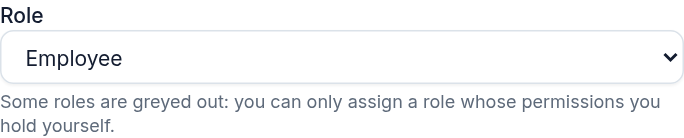
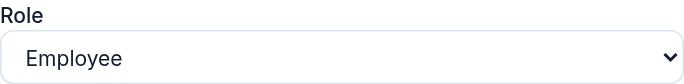
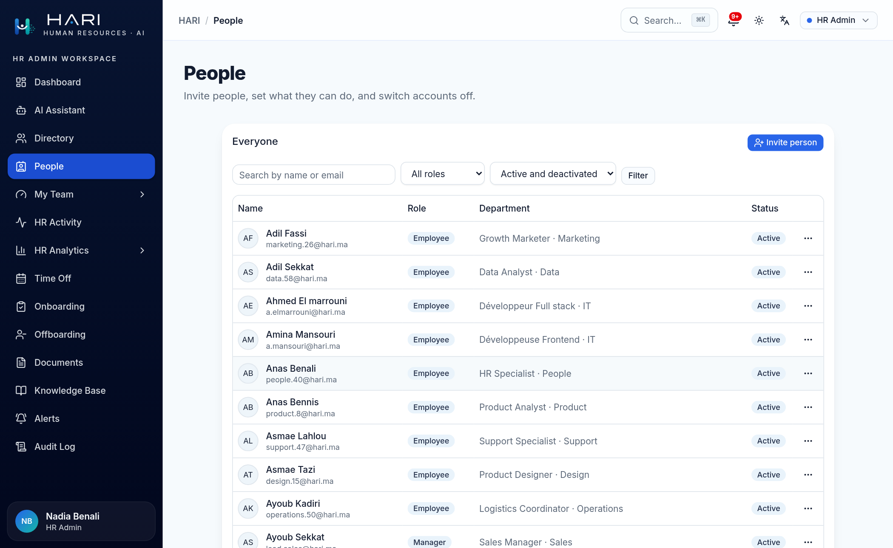
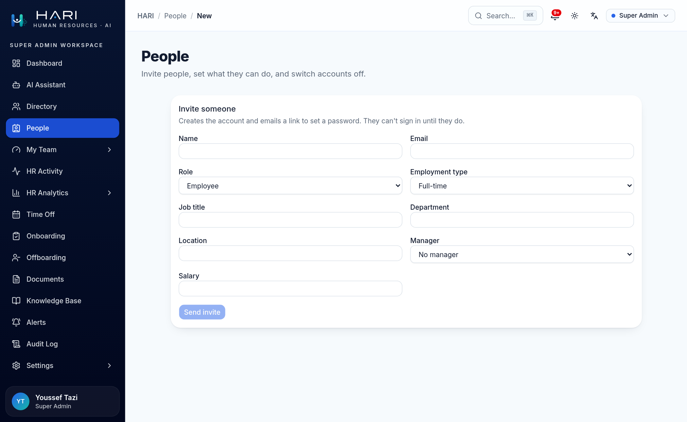
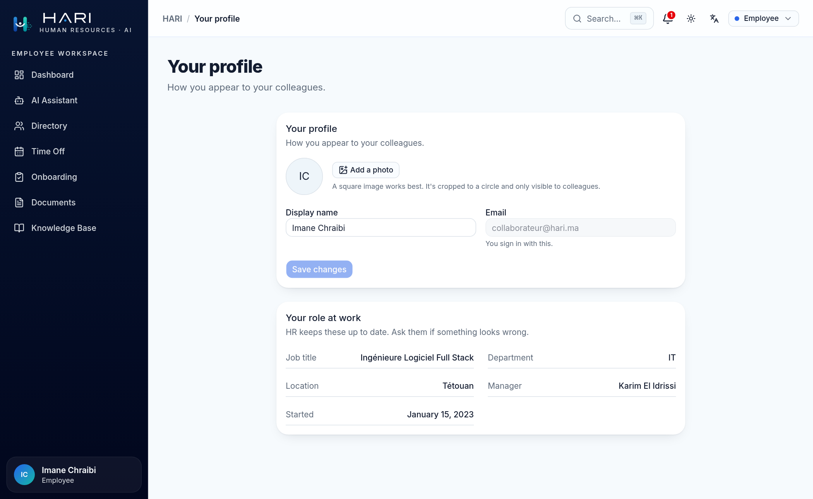

# People: inviting, editing, and deactivating accounts

`/people` is HR's admin for the people in the org: it invites new accounts, edits an
employee's profile and role, and switches a login off. Provisioning is server-side and
permission-gated, so an account exists only because someone with the right role made it.

This guide shows what each role can do there, and what the server refuses.

Every screenshot was taken from a running instance against the seeded demo data, signed in
as the demo account named in the caption.

## The short version

|                                   | Employee | Manager | HR Admin | Super Admin |
| --------------------------------- | :------: | :-----: | :------: | :---------: |
| Open `/people`                    |    no    |   no    |   yes    |     yes     |
| Invite someone                    |    no    |   no    |   yes    |     yes     |
| Change someone's role             |    no    |   no    |   yes    |     yes     |
| Assign Super Admin                |    no    |   no    |    no    |     yes     |
| See and set salary                |    no    |   no    |   yes    |     yes     |
| Deactivate an account             |    no    |   no    |   yes    |     yes     |
| Edit their own name and photo     |   yes    |   yes   |   yes    |     yes     |

That single "no" for HR Admin is the point of this guide, and the next section is about it.

## Managing people is not administering the platform

`/people` is gated on `employee:manage`; `/settings/roles` on `admin:settings`. HR holds the
first and not the second. So HR decides who is a Manager; a Super Admin decides what a
Manager is. Neither can do the other's job.

That split only means something because of one rule: you can only assign a role whose
permissions you hold yourself. Without it, HR could put someone into Super Admin (or make
a second account and put *themselves* there), and the separation would be a label on a door
with no lock.

Open the role picker on the invite form and the two see different lists. This is a native
select, so a screenshot cannot show it mid-drop; here is what it actually contains:

| Option | as HR Admin | as Super Admin |
| --- | :---: | :---: |
| Employee | selectable | selectable |
| Manager | selectable | selectable |
| HR Admin | selectable | selectable |
| Super Admin | disabled | selectable |
| Field Auditor *(custom)* | selectable | selectable |

A disabled option is invisible until you open the dropdown and silent even then, so the
rule is stated under the field; HR is told why rather than left guessing:

A Super Admin holds every permission, so nothing is greyed out and no note appears:

The rule reads the live matrix, not a hierarchy, so it keeps working for roles that did not
exist when it was written. *Field Auditor* (created in the [Roles
guide](./roles-and-permissions.md)) holds four permissions HR already has, so HR may assign
it freely. Add `admin:settings` to that same role and HR can no longer assign it, without
anyone editing a list of "roles HR may grant".

## The roster

`/people`, as HR. Filters live in the URL and the form is a plain GET, so a filtered view is
a link you can send someone.

*Invite pending* is a real state, not a guess: it means no password **and** no confirmed
email, so the invite link is still the only way in. (Deriving it from "email not verified"
would have flagged every seeded account, which have passwords and simply never used a magic
link.)

## Inviting someone

The account and the employee record are created together, in one transaction, with no
password. A one-time link is emailed; until it is used, the person cannot sign in.

This keeps HARI's oldest auth invariant intact. **Sign-in never creates an account**: even
Google's callback rejects an unknown email. Provisioning is a server-side, permission-gated
act, and the invite only opens a door to an account HR already made.

The link reuses the machinery already behind password resets and magic links: only a SHA-256
hash is stored, it is single-use, and it is compared in constant time. The one difference is
its life: seven days rather than thirty minutes, because the recipient is not sitting at
their desk when HR provisions them, and a same-day expiry would just mean re-inviting
everyone hired on a Friday.

Its screen is the reset screen with honest words: an invite says *Welcome, choose a
password*, a reset says *you asked to change yours*. The kind travels with the form and the
server narrows it to those two, so a sign-in secret (a magic link or an OTP) can never
be spent on changing a password.

## What the server refuses

| You try to | It answers | Because |
| --- | --- | --- |
| Assign a role wider than your own | `escalation` | otherwise HR mints a Super Admin |
| Re-role or deactivate someone who outranks you | `target_outranks` | you can only manage people whose access you already hold |
| Change your own role | `self_forbidden` | ask another admin; nobody promotes themselves |
| Deactivate yourself | `self_forbidden` | the same reason, and it locks you out |
| Demote or disable the last active admin | `would_lock_out` | `/settings` would have no key holder |
| Set a salary you cannot read | *silently ignored* | the field is omitted from the write, not zeroed |
| Make someone their own manager | `manager_cycle` | checked up the whole chain, not just one hop |
| Reuse an email | `email_taken` | it is the sign-in identity |

Two of those are worth expanding.

**Salary follows the read rule.** A caller without `salary:read:all` never sees the field and
cannot set it. On an edit it is left out of the write entirely rather than written as zero, so
someone who was never allowed to see a number cannot erase it either; a new hire they invite is
simply created at zero, for whoever *can* see pay to fill in later.

**The manager check walks the chain.** The org chart is self-referential and nothing else
prevented a loop; an undetected one would hang every manager-scoped query in the app.

## Deactivating is not deleting

Two different acts, deliberately kept apart:

- Deactivate (`/people`) switches the login off. The person's record is untouched.
- Offboard (`/offboarding`) archives the person: status becomes `TERMINATED`, never
  a delete, because turnover analytics and historical payroll need them.

Deactivation takes effect immediately, which is a property of how HARI reads a session
rather than anything the people admin does. Role and permissions are resolved from the
database on every request, so a deactivated account is ejected on its next click, not
whenever its token happens to expire. It is refused at every sign-in door too, and refused
indistinguishably from a wrong password, so the form never reveals that the account exists.

The same mechanism is why a role change lands on the next click. There is no "sign out and
back in for changes to take effect".

## Your own profile

Everyone has one, at `/profile`, reached from the account menu. You own your display,
your name and your face:

Everything under *Your role at work* is deliberately read-only. Letting people rewrite their
own job title or manager would corrupt the org chart and every analytic built on it, so
those stay HR's, on the same `/people` form. Email is read-only for a different reason: it is
the sign-in identity and the key every auth token is issued against.

A photo is compressed in the browser, then re-encoded server-side to a square 512px WebP,
so what is stored is always a clean raster, whatever was uploaded. Unlike the Knowledge Base
cover images, which are decorative and served publicly behind an unguessable key, an avatar
requires a session to fetch: a face is personal data under HARI's CNDP posture, and an
unguessable URL is not the bar it deserves.

Replacing a photo deletes the old object, so changing it ten times leaves one file rather
than ten.

---

Every mutation here is on the audit trail: `USER_INVITED`, `USER_UPDATED`,
`USER_ROLE_CHANGED`, `USER_DEACTIVATED`, `USER_REACTIVATED`. A role change records
`{ from, to }`, because a role slug is a code. The target's name and email are not, and never
appear there.

The contract: [`docs/architecture/authorization-invariants.md`](../architecture/authorization-invariants.md).
The sign-in flows: [`docs/auth.md`](../auth.md).
