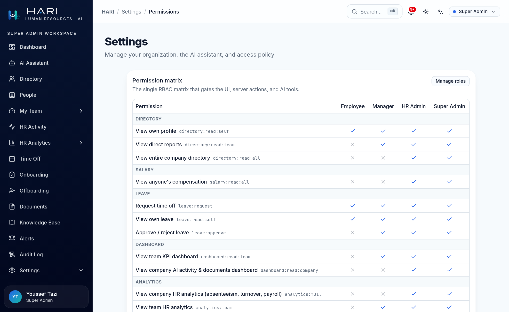
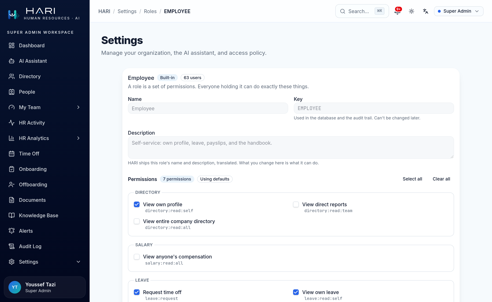
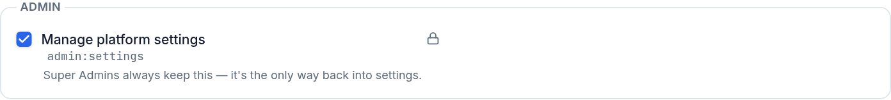
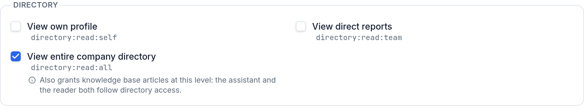
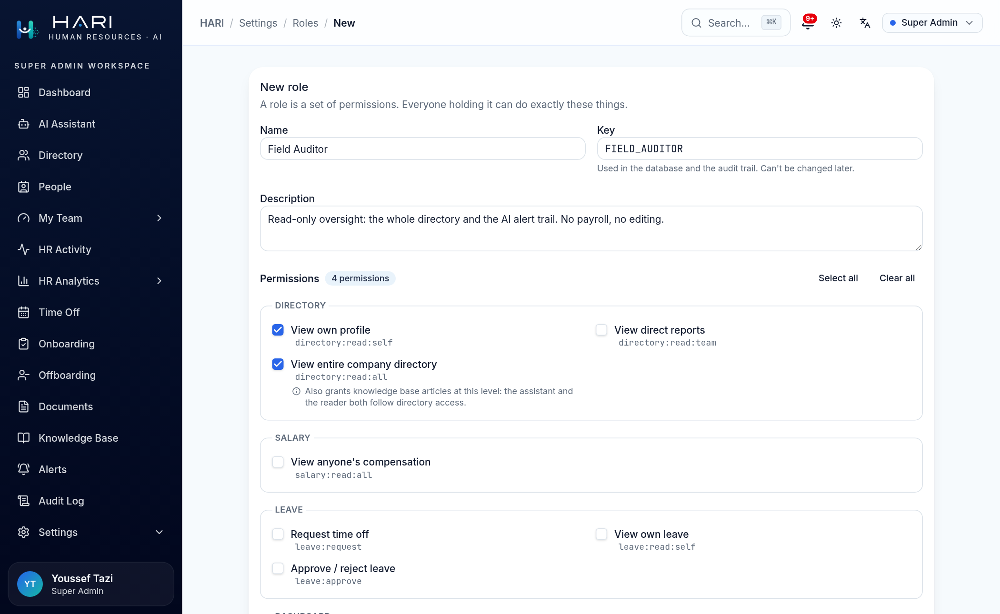
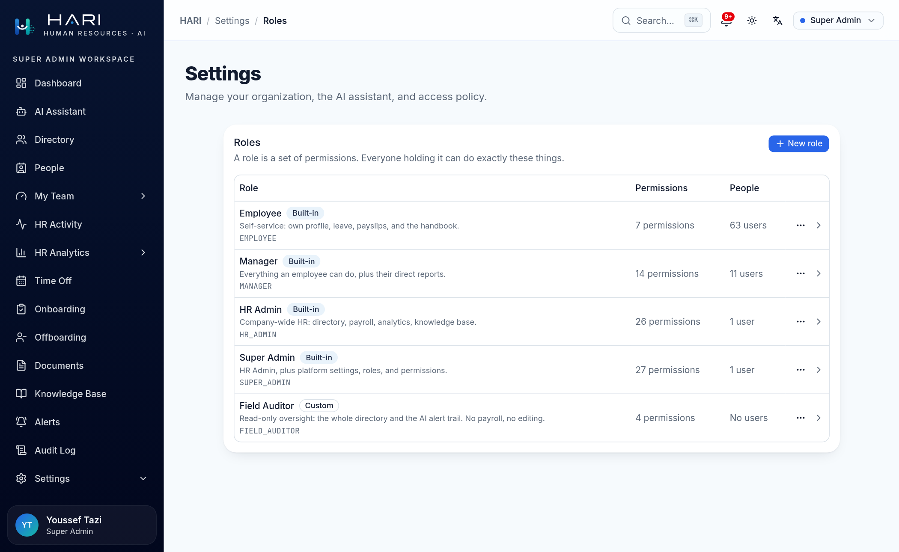
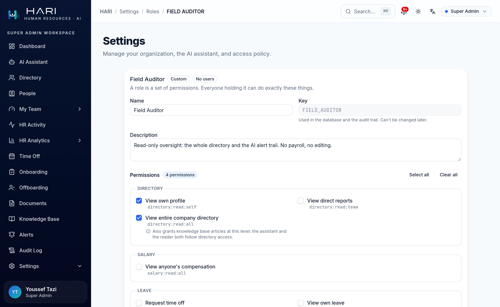
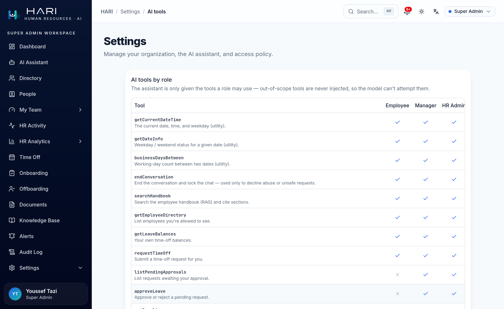

# Roles & permissions: editing what each role can do

HARI has one permission matrix. It gates the sidebar, the pages, every database read, and
which tools the AI assistant is even shown. A Super Admin edits that matrix at runtime:
`/settings/roles` changes what any role may do and defines roles beyond the four that ship,
and `/settings/permissions` shows every role's permissions side by side.

This guide shows how that editing works, and, more importantly, what it refuses to let you
do.

Every screenshot was taken from a running instance against the seeded demo data, signed in
as the demo account named in the caption.

## The short version

|                                        | Employee | Manager | HR Admin | Super Admin |
| -------------------------------------- | :------: | :-----: | :------: | :---------: |
| Permissions held (of 27)               |    7     |   14    |    26    |     27      |
| AI tools offered (of 13)               |    9     |   13    |    13    |     13      |
| See the permission matrix              |    no    |   no    |    no    |     yes     |
| Change what a role may do              |    no    |   no    |    no    |     yes     |
| Create a role                          |    no    |   no    |    no    |     yes     |
| Manage people                          |    no    |   no    |   yes    |     yes     |

Two rows deserve a second look. HR Admin and Super Admin differ by exactly one
permission, `admin:settings` (26 against 27), and it unlocks zero AI tools. From Manager
upward the assistant is identical; what changes is what its tools return.

And **HR Admin cannot open this page at all.** Editing the matrix is a Super Admin's job;
managing people is HR's. That split is the whole design, and the [People
guide](./people.md) is its other half.

## Roles are data. Permissions are code.

This is the one distinction worth understanding, because everything else follows from it.

A permission is a code artifact. `salary:read:all` means something only because
`lib/hr.ts` reads that literal and strips a column when it is absent. A permission no code
reads would enforce nothing: it would be a checkbox that lies. So the 27 permissions are a
compile-time list, and the editor lets you pick from it.

A role is just a named set of them, which is data, so you can make your own.

The consequence is a security property rather than a limitation: an administrator cannot
invent a permission through a form. The resolver only ever accepts strings the code
already enforces; anything else in a role's row is dropped on read. That is what keeps
`engagement:read:self` impossible: the permission that would let someone read their own
burnout score, which HARI deliberately does not have. It is not blocked by a rule someone
has to remember. There is nowhere to type it.

## The matrix, at a glance

`/settings/permissions` shows every role beside every other, which no per-role editor can.
It reads the effective matrix, so it cannot disagree with what the app enforces.

The 27 permissions read `domain:action:scope`, so the page groups them by domain: 15
labelled clusters instead of one long list. Nothing maintains that grouping; it is already
in the string.

## Editing a built-in role

`/settings/roles/EMPLOYEE`. The name, key and description are greyed out: those are HARI's
own copy, translated into English and French, so a value typed there would never be
displayed. What you change about a built-in is what it can *do*.

The *Using defaults* badge is load-bearing. A built-in role stores no permission list at all
until you change one; it defers to the code. That is why the shipped matrix has exactly one
source of truth, and why *Reset to defaults* is a real undo rather than a copy of today's
values.

## Two things the editor will not let you do

### Lock everyone out

`admin:settings` on Super Admin is pinned, with the reason next to it. `/settings` is the
only door to this page; unticking that box would close it behind you, permanently, with no
way back but a database console.

The pin is only the visible half. The server refuses the same save, and refuses any save,
role change or deactivation that would leave zero active people able to reach settings,
including the last Super Admin's own demotion.

### Grant what you do not have

You can only hand out permissions you hold yourself. Revoking is always allowed: the matrix
may narrow, never widen past the person editing it.

Without this rule the split between HR and Super Admin would be decoration: HR could mint
a role with `admin:settings`, assign it, and become one.

## The consequence nobody would guess

Knowledge Base access is derived from directory access. Grant "view the whole company" and
you have also opened every HR-only handbook article, to the reader **and** to the
assistant's retrieval.

That is deliberate: it stops the document library drifting away from the rest of the app.
But it is not discoverable, so the editor says it at the checkbox, as you tick it. This is
the only place a person would ever meet that rule.

## Making a role that does not exist

*Field Auditor*: read-only oversight. The whole directory and the AI alert trail, no payroll,
no editing. Four permissions, chosen from the list.

It appears beside the built-ins, marked *Custom*, holding nobody.

Unlike a built-in, its name and description are editable: they are your words, not
HARI's, so they are stored rather than translated. It can also be deleted, but only while
nobody holds it; the database enforces that with a foreign key, not just the UI.

## What the assistant does with it

Here is the test that matters. `/settings/ai-tools` renders from `toolsForSubject()` itself,
the same function that decides, per turn, which tools the model is shown. It is the running
configuration, not a description of one.

Field Auditor already has a column. Six tools, and no code changed:

| | Employee | Field Auditor | Manager |
| --- | :---: | :---: | :---: |
| Permissions | 7 | 4 | 14 |
| Tools offered | 9 | 6 | 13 |
| `searchHandbook` | yes | yes | yes |
| `getEmployeeDirectory` | yes (self only) | yes (everyone) | yes (own team) |
| `getPayslip` | yes (own) | no | yes (own) |
| `approveLeave` | no | no | yes |

The Field Auditor column is the interesting one. It sees more people than a Manager and
fewer tools than an Employee, because it was assembled from permissions rather than picked
from a hierarchy. The four built-in roles are strictly nested (Employee ⊂ Manager ⊂ HR
Admin ⊂ Super Admin), and a custom role simply is not on that ladder. Nesting is a property
of the defaults, not a rule of the system.

Note also what a Field Auditor is *not* offered: no `getPayslip`, though it reads the whole
directory. Directory access and payroll access are different permissions, and the tool is
gated on the one it needs.

The table grows a column per role and its tool descriptions are long, so it scrolls
sideways inside its own card; Super Admin and Field Auditor are the two columns off the
right-hand edge above. That is not a layout that could be widened out of the problem: a
sixth role would overflow any fixed width. The figures in the table above come from
`toolsForSubject()` directly.

## Where it is enforced

The editor mirrors the rules. It does not implement them.

Every guard above lives in `lib/roles.ts` and is re-checked there, because a hand-crafted
POST never sees a disabled checkbox. The UI greys things out so you learn the rule; the
server refuses so the rule is true.

| Rule | UI | Server |
| --- | --- | --- |
| Only Super Admins may edit roles | page hidden from the nav | `can(caller, "admin:settings")` in every function |
| Super Admin keeps `admin:settings` | checkbox pinned, reason shown | save refused (`would_lock_out`) |
| Someone must be able to reach settings | none | counts active holders before every save |
| Grant only what you hold | ungrantable boxes disabled | `escalation` on the diff, not the whole list |
| Built-in slugs are permanent | key field disabled | ignored on write |
| A role in use cannot be deleted | delete greyed, reason given | `role_in_use`, plus an `ON DELETE RESTRICT` foreign key |
| Only real permissions are stored | you pick from a list | every row filtered through `isPermission` on read |

Every change is on the audit trail (`ROLE_CREATED`, `ROLE_UPDATED`, `ROLE_DELETED`) with the
permission keys it granted. Keys and role slugs are codes, not personal data, so they can be
recorded in full, the same no-PII contract the rest of the trail keeps.

The contract behind all of it: [`docs/architecture/authorization-invariants.md`](../architecture/authorization-invariants.md).
