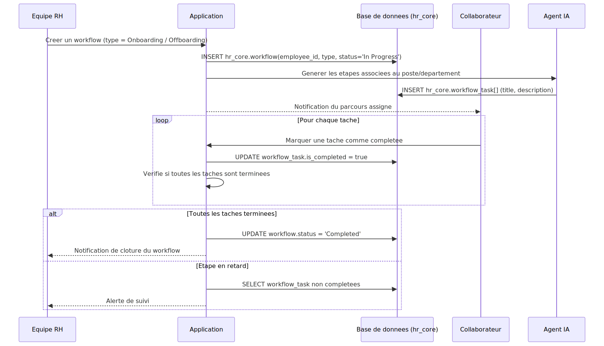

# Vérification de compatibilité — `HARI_Database_Schema_v1.0.sql`

> **Verdict : ✅ Schéma compatible** avec le cahier des charges YDAYS 2026.
> Aucune table à supprimer. Quelques extensions mineures recommandées (voir §5),
> mais l'architecture proposée couvre l'ensemble des domaines fonctionnels attendus.

---

## 1. Synthèse

| Critère | Évaluation |
|---|---|
| Authentification & RBAC multi-tenant | ✅ Couvert (`auth.tenant`, `auth.role`, `auth.user`) |
| RH cœur (employés, départements, absences, workflows) | ✅ Couvert (`hr_core.*`) |
| Assistant IA conversationnel + RAG documentaire | ✅ Couvert (`ai.hr_document`, `ai.document_chunk`, `ai.chat_session`, `ai.ai_event`) |
| Détection du désengagement / risque social | ✅ Couvert (`ai.burnout_risk_assessment`, score + explication + plan d'action) |
| Sécurité, audit, alertes | ✅ Couvert (`audit.alert`, `audit.security_audit_log`) |
| Conformité (consentement explicite) | ⚠️ Non présent — à ajouter en extension (non bloquant) |
| Cohérence technique avec le starter réel (`prisma/schema.prisma`) | ⚠️ `embedding` en `TEXT` au lieu de `halfvec(384)` — déjà anticipé dans un commentaire du fichier SQL |

**Conclusion : le schéma est globalement compatible.** Les écarts identifiés sont additifs
(nouvelles colonnes/tables) et n'impliquent aucune remise en cause de l'architecture proposée.
Détail complet des 12 écarts : voir `docs/03-conception/conception.md`.

---

## 2. Diagramme MCD (modèle conceptuel de données)

*Source éditable : [`diagrams/01-mcd.mmd`](./diagrams/01-mcd.mmd)*

---

## 3. Diagramme de classes (vue applicative)

*Source éditable : [`diagrams/02-classes.mmd`](./diagrams/02-classes.mmd)*

---

## 4. Diagramme de séquence — exécution d'un workflow RH

*Source éditable : [`diagrams/03-sequence-workflow.mmd`](./diagrams/03-sequence-workflow.mmd)*

---

## 5. Diagramme d'architecture générale du projet

*Source éditable : [`diagrams/04-architecture.mmd`](./diagrams/04-architecture.mmd)*

---

## 6. Schéma de workflow (cycle de vie `hr_core.workflow` / `workflow_task`)

*Source éditable : [`diagrams/05-workflow-state.mmd`](./diagrams/05-workflow-state.mmd)*

---

> Les diagrammes ont été générés avec [Mermaid CLI](https://github.com/mermaid-js/mermaid-cli)
> (`@mermaid-js/mermaid-cli`) à partir des fichiers source `.mmd` du dossier
> [`diagrams/`](./diagrams/). Pour régénérer après une modification :
> `npx -y @mermaid-js/mermaid-cli -i diagrams/<fichier>.mmd -o diagrams/<fichier>.svg -b transparent`

---

## 7. Recommandations (extensions non bloquantes)

| # | Extension recommandée | Justification |
|---|---|---|
| 1 | `auth.consent` (consentement explicite) | Exigence de conformité du cahier des charges |
| 2 | `embedding` en `halfvec(384)` + index HNSW | Cohérence avec le starter réel (`prisma/schema.prisma`) |
| 3 | `due_date` / `sequence_order` sur `workflow_task` | Permet les alertes de retard illustrées au §6 |
| 4 | `ai.generated_document` | Historisation des documents RH générés (attestations, courriers) |

Détail complet (12 écarts, priorisation par sprint) : `docs/03-conception/conception.md`.
